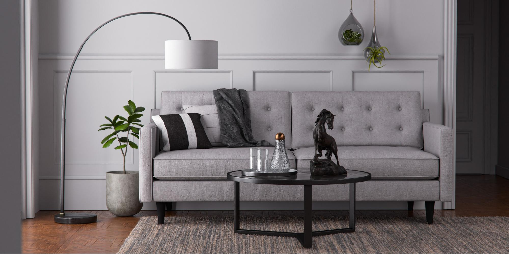

# Tips en technieken voor het beheersen van 3D-belichting in CGI

Leer meer over 3D-belichting en hoe u verschillende lichtomstandigheden kunt maken die een door de computer gegenereerde scène en de weergave van objecten in de scène volledig kunnen veranderen.

We zien de wereld om ons heen met onze zintuigen: we horen, voelen, ruiken, zien. We kunnen zien omdat onze ogen informatie oppikken die ons wordt gebracht door elementaire deeltjes die fotonen worden genoemd. Deze informatie wordt verwerkt door onze hersenen om een beeld te produceren. Wat we interpreteren als een objectkleur, glans, transparantie of metaalkwaliteit zijn allemaal producten van de interactie tussen de fotonen en het oppervlak van het object.

Lichtmechanica in een door de computer gegenereerde 3D-scène volgt hetzelfde natuurlijke principe van fotonscattering, via een proces dat raytracering wordt genoemd. Hiermee stuitert u vormen af en communiceert u met de materialen ervan. Zo definieert u in feite hoe objecten in de uiteindelijke afbeelding worden weergegeven. Lichten geven de dimensionaliteit weer van alles wat in een 3D-scène bestaat.

Sommige materialen zijn gevoeliger voor belichtingsomstandigheden dan andere. Neem bijvoorbeeld metalen: een chroomobject reflecteert alles eromheen. Als een licht wordt verplaatst, helderder of groter wordt, is al die informatie direct zichtbaar op het chroomoppervlak in bijna spiegelend detail, zodat kan het volledig verschillend van één lichtvoorwaarde aan andere lijken.

## Werken met 3D-lichten om effectieve 3D-rendering te maken

Het proces voor het maken van een 3D-renderbewerking is nooit helemaal hetzelfde, maar dit zijn de meest voorkomende stappen:

1. Objecten maken of ophalen
1. Scèneverzameling
1. De scène omvormen
1. **Verlichting**
1. Materiaal maken of toewijzen
1. Renderen

Wanneer u aan de verlichtingsfase komt, is het ideaal om uw lichten op te zetten alvorens aan de materialen te werken. Hiervoor kunt u een neutraal grijs matte materiaal aan de hele scène toewijzen. Zo kun je duidelijker zien en begrijpen hoe de lichten het object silhouetten in de scène beïnvloeden. Nadat de materialen zijn voltooid, moet de belichting mogelijk verder worden verfijnd.

Het is het beste om één voor één aan de lichten te werken. Het actieve licht moet het enige zijn dat zichtbaar is in de scène, terwijl alle andere lichten tijdelijk moeten worden uitgeschakeld. Op deze manier kun je zien hoe een specifiek licht de scène beïnvloedt, en dat veranderen door te werken aan de eigenschappen ervan, zoals de positie, de richting, de intensiteit, enzovoort.

Een andere handige truc is om een bol te maken met glanzend metaal (een chroom of een spiegel). Deze &#39;spiegelbal&#39; reflecteert in feite de hele scène eromheen, zodat je gemakkelijk de positie, richting of grootte van het licht kunt bepalen. In het geval van de omgevingslichten kun je de reflectie zien in de spiegelbal, wat helpt om de oriëntatie in de ruimte in te stellen.

## Soorten lichten in Adobe [!DNL Dimension]

### Omgevingslichten

Omgevingslichten zijn rechthoekige (bolvormige) afbeeldingen die rond de hele scène worden geplaatst. Zoals de naam suggereert, dienen deze lichten om de hele omgeving na te bootsen, inclusief de lichtbronnen, die erin zijn opgeslagen.

Wanneer u een nieuwe scène maakt in [[!DNL Dimension]](https://www.adobe.com/products/dimension.html), wordt er een standaard omgevingslicht voor u gemaakt. Daarom kun je onmiddellijk iets zien in de scène. Adobe [!DNL Dimension] Starter Assets bevat een aantal omgevingslichten, die u meteen kunt proberen. Bovendien: [Adobe [!DNL Stock]](https://stock.adobe.com/search?filters[content_type:3d]=1&amp;filters[3d_type_id][0]=2&amp;load_type=3d+lp) biedt een enorme, geselecteerde selectie van omgevingslichten.

Omgevingslichten leveren zeer realistische resultaten op en kunnen u veel tijd besparen. Om iets soortgelijks manueel te bereiken, zou u het volledige milieu in 3D (met inbegrip van diverse lichtbronnen) moeten creëren, wat een significante hoeveelheid werk is.

Er zijn vele manieren om omgevingslichten te maken, zoals het vastleggen van beelden vanuit een 3D-scène, vanuit een foto en het gebruik van parametrische systemen. Als het omgevingslicht van een 3D-scène is gemaakt, is het proces eenvoudig. De uitvoerafbeelding moet 32 bits zijn, zodat de lichtinformatie van alle lichten in de scène wordt vastgelegd. De 3D-camera moet de rechthoekige projectie gebruiken (om een bolvormige afbeelding uit te voeren).

Je kunt ook omgevingslichten maken door foto&#39;s van de echte wereld vast te leggen. Voor deze workflow is een camera van 360 nodig (bijvoorbeeld [Ricoh Theta Z1](https://theta360.com/en/about/theta/z1.html)). De camera wordt vervolgens gebruikt voor belichtingsbracketing, of voor het maken van meerdere opnamen van dezelfde omgeving, genomen met een reeks verschillende belichtingswaarden (van onderbelicht tot overbelicht). Deze opnamen worden vervolgens gebruikt om afbeeldingen met 32 bits samen te stellen, vaak HDR&#39;s genoemd (kort voor een High Dynamic Range). Een manier om een dergelijke afbeelding samen te stellen is met de functie Samenvoegen tot HDR in Photoshop. Het ingesloten belichtingsbereik wordt de intensiteitseigenschap.

In beide gevallen worden de lichtbronnen (en hun intensiteit) in deze afbeeldingen &quot;gebakken&quot; en wordt het licht uitgestoten zodra ze worden gebruikt [!DNL Dimension].

Met deze methoden heb je alle benodigde belichting, reflecties en details vastgelegd, maar met 3D-apps kun je ze blijven bewerken in de 3D-ruimte. Zo kun je de belichtingsrotatie aanpassen en de algehele intensiteit en kleur wijzigen.

### Gerichte lichten

Naast omgevingslichten, die licht van 360 graden uitstralen, zijn er ook richtingslichten, die alleen licht van één richting uitstralen. Ze worden gebruikt om flitslichten en andere soorten lichten te emuleren die afkomstig zijn van een duidelijk gedefinieerde straler. Ze kunnen de vorm hebben van een cirkel of een vierkant.

Het gebruik van richtingslichten biedt volledige controle over de belichtingsinstellingen. Het belichten van de scène met deze lichten gebeurt op dezelfde manier als bij traditionele fotografie, waarbij elk licht onafhankelijk kan worden bestuurd, zodat u uw eigen virtuele fotografische belichting kunt maken. Een van de meest gebruikte belichtingsinstellingen is het 3-punts lichtsysteem.

[!DNL Dimension] heeft een handige handeling, Aim Light at Point, waarmee u de rotatie en hoogte kunt bepalen door eenvoudig over een 3D-object te klikken en te slepen. Op deze manier kunt u de lichtstralen dynamisch naar een andere richting leiden. Deze parameters kunnen ook handmatig worden aangepast.

U kunt de kleur en de intensiteit van de richtingslichten wijzigen en de vorm van de lichtbron aanpassen - de lichtbron cirkelvormig of rechthoekig maken, rekken of groter maken. Tot slot kunt u de randen van de lichtbron verzachten.

![De vorm van een gericht licht wijzigen in Adobe [!DNL Dimension]](assets/Mastering3dlighting_12.gif)

Als u de lichtbron kleiner maakt dan het object, worden de schaduwen scherper, met een scherpere omtrek, omdat de stralen niet voorbij het verlichte object kunnen komen. Grotere lichtbronnen produceren zachtere schaduwen, omdat in dit geval de stralen uit alle zijden van het object komen (rood gemarkeerd in de afbeelding hieronder), waardoor een array van schaduwen ontstaat. Deze schaduwen worden verzacht door de stralen die uit de tegenovergestelde richting komen.

### Zon en lucht

Zonlicht is een speciaal soort richtingslicht. Het instellen van het licht lijkt sterk op een normaal gericht licht, maar dit licht verandert automatisch de kleur met de hoogte. Wanneer het dicht bij de horizon staat (lage hoogtewaarden), wordt het geleidelijk warmer om de zonsondergang te simuleren. U kunt de kleur ook wijzigen met behulp van voorinstellingen. Intussen zal de zachtheid van de schaduw beïnvloeden.

![Belichtingseigenschappen voor zonlicht bewerken op een 3D-automodel in Adobe [!DNL Dimension]](assets/Mastering3dlighting_15.gif)

We kunnen de lucht nabootsen met behulp van omgevingslichtjes, en elk omgevingslicht dat de lucht bevat kan worden gebruikt. Nu moeten we het zonlicht (gemaakt in [!DNL Dimension]) met de zon, vastgelegd in het omgevingslicht. Een snelle manier om dit te doen is een bol te maken en er een metaal materiaal aan toe te wijzen. Dit zal ons voorzien van real-time reflecties van het milieu, zodat we Aim licht kunnen gebruiken op het punt om het zonlicht af te stemmen op de zon.

Als het omgevingslicht een overzwevende hemel bevat, kan de eigenschap cloudiness worden gebruikt om deze voorwaarden beter aan te passen.

![Bezig met manipuleren van wolkeigenschappen voor luchtverlichting op een 3D-automodel in Adobe [!DNL Dimension]](assets/Mastering3dlighting_17.gif)

Als het zonlicht en het omgevingslicht eenmaal zijn aangesloten, kunt u ze samen roteren met behulp van de eigenschap Globale rotatie.

### Op object gebaseerde lichten

Objecten kunnen worden omgezet in lichtbronnen door de eigenschap Gloed in te schakelen voor hun materialen. Op deze manier kunt u objecten maken zoals lampen, neonlichten, softboxen en allerlei soorten schermen en schermen.

Het belangrijkste voordeel van dit type verlichting is het wegvallen van de intensiteit, wat zeer natuurlijke resultaten oplevert. Dit is erg handig voor productvisualisatie of andere op studio gebaseerde scènes.

U kunt de zachtheid van de schaduwen bepalen door het gloeiende object omhoog of omlaag te schalen met het gereedschap Transformatie. Het groter maken zal ook de lichtintensiteit verhogen.

In tegenstelling tot de eerdere typen lichten die we hebben bedekt, kunnen deze lichten naast gewone kleuren ook gebruikmaken van structuren. De structuren kunnen worden gekoppeld aan de basiskleur van hun materialen en de lichtintensiteit wordt geregeld met een gloedschuifregelaar.

## Voorbeelden van effectieve 3D-belichting

### Productbelichting

Er zijn veel fotografische technieken voor het instellen van het licht voor een productafbeelding. We gebruiken een van de meest gebruikte instellingen, namelijk het 3-punts lichtsysteem.

Deze instelling bestaat uit drie lichten:

1. **Hoofdlicht:** gebruikt als de primaire bron, deze schijnt ongeveer vanuit de richting van de camera

   

1. **Rimlicht:** Aan de tegenovergestelde kant van de toets wordt dit gebruikt om het silhouet van het onderwerp te onthullen.

   

1. **Vullicht:** minder intensief en als aanvulling op donkere gebieden, wordt dit gebruikt voor gebieden die de vorige twee lichten niet bereiken.

   

Er zijn twee manieren om de 3-punts belichting in [!DNL Dimension] - gebruik van richtingslichten (deze afzonderlijk aan de scène toevoegen of een voorinstelling voor 3-punts licht gebruiken) of via gloeiende objecten.

### Creatieve belichting

Creatieve verlichting wordt gebruikt wanneer fysieke nauwkeurigheid niet het belangrijkste doel is. Dit omvat abstracte en surrealistische scènes van allerlei soorten, dus er zijn geen echte grenzen waar onze verbeeldingen ons mee kunnen brengen.

In het bovenstaande voorbeeld was het de bedoeling om een droomachtige omgeving te profileren: snoep, pastelkleuren en vloeiende oppervlakken. Het verlichtingssysteem bestaat uit drie gloeiende platen (twee aan de zijkant en de hoofdaan de onderkant). Alle gloeiende platen zijn onrealistisch groot, waardoor zeer vloeiende schaduwen en hooglichten ontstaan. De lichtbronnen zijn gekleurd en die kleur wordt overgebracht naar het materiaal dat is toegewezen aan de objecten in de scène.

Het onderwerp van de scène (buizen) is volledig omringd door de muurgeometrie. Dit zorgt ervoor dat lichte stralen heen en weer stuiteren en zich op interessante manieren mengen. Afspelen met koele VS warme tinten produceert vaak een mooi contrast (deze techniek wordt soms gebruikt bij portretfotografie).

### Interne visualisatie

Het maken van een visualisatie van een 3D-binnenkant volgt een aantal regels, die vrijwel altijd goede resultaten garanderen. Voor dit gebruik zullen we alleen rekening houden met natuurlijk licht (geen kunstmatige bronnen, zoals lampen).

In de eerste plaats moet een scène als deze zich in een gesloten omgeving bevinden. Net als in het echte leven heeft het interieur muren, vloer, plafond en ramen nodig. Dit zal ervoor zorgen dat het licht door de vensters komt en dan rond (via een proces genoemd het straal vinden) stuitert. Dit gedrag produceert zeer natuurlijke belichting (de afgesloten gebieden, zoals de hoeken, worden bijvoorbeeld donkerder).

Omdat de scène bijna volledig omgeven is door architecturale geometrie, zullen we zeer weinig illuminatie zien en bijna geen reflecties uit het Milieu-licht. Maar in dit geval bouwen we eigenlijk onze eigen omgeving, het interieur zelf. Het licht zal reageren met de objecten in de scène door ze en de omringende muren eraf te laten stuiteren. De objecten weerspiegelen alleen elkaar en de omliggende muren. Desalniettemin is het een goed idee om een omgevingslicht toe te voegen dat de lucht in zich draagt. Hiermee wordt een onscherpe blauwe vulling toegevoegd.

De eenvoudigste manier om dit licht in te stellen is door vlakken met gloeiende materialen te gebruiken. In dit geval hebben we drie vlakken die alle openingen in het binnenland bedekken.

De intensiteit van het licht wordt bepaald door de gloedeigenschap op de materialen van de vlakken. U kunt een kleur of zelfs een structuur toevoegen die u kunt gebruiken om interessante schaduwen te werpen. Het gebruik van gloedmaterialen zorgt ook voor het wegvallen van de lichtintensiteit, wat heel belangrijk is voor binnenverlichting.

### Openluchtverlichting

Het creëren van buitenverlichting is vrij eenvoudig en komt neer op het gebruiken van een zon en het lichtsysteem van de Lucht (zie hierboven). Het is belangrijk om zonlicht correct af te stemmen op het op lucht gebaseerde omgevingslicht - waarbij aandacht wordt besteed aan zowel de oriëntatie als de waarde voor de troebelheid.

De scène zelf speelt hierin een grote rol. U bereikt boeiende resultaten door objecten in uw scène te gebruiken als katalysatoren die reageren op het licht. In de boerenweergave die hierboven wordt getoond, worden de objecten (verschillende planten, stammen en bomen) dicht bij elkaar geplaatst.

Dit betekent dat er veel complexe interactie met raytracering zal zijn, naarmate het licht tussen de objecten beweegt. Gearceerde gebieden worden donker weergegeven (zoals verwacht), terwijl belichte gebieden helder blijven.

![Globale rotatie gebruiken in Adobe [!DNL Dimension] om het zon- en luchtlichtsysteem in een 3D-scène te heroriënteren](assets/Mastering3dlighting_34.gif)

Ik hoop dat dit overzicht het belang illustreert van het beheersen van 3D-lichten in verschillende situaties. Je moet er klaar voor zijn om boeiendere resultaten te produceren.

Fijne belichting! Download de [nieuwste release](https://creativecloud.adobe.com/apps/download/Dimension) van Dimension vandaag.
