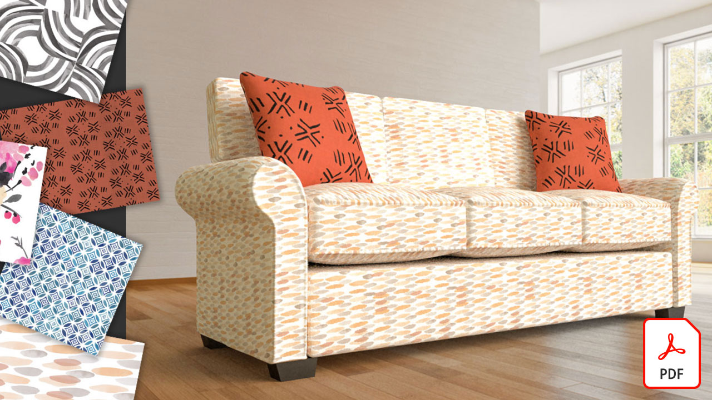

# Adobe 3D- en VR-zelfstudies

Creëer sneller boeiende content in 3D met hoogwaardige modellen, materialen en belichting. [!DNL Dimension] maakt het eenvoudig om merkvisualisaties, illustraties, productmodellen, verpakkingsontwerpen en ander creatief werk te bouwen.

## Klik om een Adobe 3D- en VR-zelfstudie te bekijken

<table>
<tr>
 <td>
   
    

   <a href="assets/CreateRealistic3DMockupswithAdobeStockandDimension.pdf"><strong>Maak realistische 3D-modellen met Adobe [!DNL Stock] en [!DNL Dimension] (PDF)</strong></a>
    

    <em>Eenvoudig een 2D-ontwerp combineren met een 3D-model met behulp van Adobe [!DNL Stock] en geplaatste afbeeldingen in Adobe [!DNL Dimension]</em>
     
  </td>
  <td>
   
    

   <a href="assets/VisualizeTextileDesignsorPatternson3DObjectswithAdobeDimension.pdf"><strong>Textielontwerpen of -patronen visualiseren op 3D-objecten met Adobe [!DNL Dimension] (PDF)</strong></a>
    

    <em>Creëer binnen enkele minuten een ultra-realistische weergave van je eindproduct</em>
     
  </td>
  <td>
   
    

   <a href="../cce/assets/VisualizeyourProductinaRealisticEnvironment.pdf"><strong>Visualiseer uw product in een realistische omgeving (PDF)</strong></a>
    

    <em>Als je wilt zien hoe je producten eruitzien in de echte wereld, Adobe [!DNL Dimension] is uw startende app</em>
     
  </td>
</tr>
   <tr>
 <td>
   
    

   <a href="mastering3dlighting.md"><strong>Tips en technieken voor het beheersen van 3D-belichting in CGI</strong></a>
    

    <em>Leer meer over 3D-belichting en hoe u verschillende lichtomstandigheden kunt maken waarmee een door de computer gegenereerde scène en de weergave van objecten in deze scène volledig kunnen worden gewijzigd</em>
     
  </td>
  <td>
   
    

   <a href="photorealistic.md"><strong>Fotorealistische virtuele fotografie maken met 3D-rendering en -composities</strong></a>
    

    <em>Leer hoe je verbluffend bedrieglijke, fotorealistische virtuele fotografie creëert met 3D-beeldcompositie en -rendering in Adobe [!DNL Dimension]</em>
     
  </td>
  <td>
   
    

   <a href="3ddimensionstock.md"><strong>Pas een 3D-model aan en merk het op met [!DNL Dimension] en Adobe [!DNL Stock]</strong></a>
    

    <em>Pas een 3D-model aan en merk het op in [!DNL Dimension] met materialen, milieu-eigenschappen, belichting en fotografie, om fotorealistische afbeeldingen te maken voor elk ontwerpproject</em>
     
  </td>
</tr>
</table>
