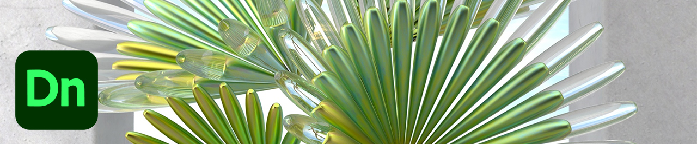

# Zelfstudies voor Adobe 3D en VR

Creëer sneller boeiende content in 3D met hoogwaardige modellen, materialen en belichting. [!DNL Dimension] maakt het gemakkelijk om merkvisualisaties, illustraties, productmodellen, verpakkingsontwerpen en ander creatief werk te maken. Selecteer een afbeelding om een zelfstudie te bekijken.

<table>
<tr>
 <td>
   
    

   <a href="substance-3d-stager.md"><strong>3D-ontwerp en -weergave</strong></a>
    

    <em>Importeer inhoud, rangschik uw scène, pas materialen en structuren toe, pas op afbeeldingen gebaseerde en fysieke belichting aan, sla camera's op met verschillende resoluties en render fotorealistische beelden</em>
     
  </td>
  <td>
   
    

   <a href="assets/CreateRealistic3DMockupswithAdobeStockandDimension.pdf"><strong>Maak realistische 3D-mock-ups met Adobe [!DNL Stock] en [!DNL Dimension] (PDF)</strong></a>
    

    <em>Combineer eenvoudig een 2D-ontwerp met een 3D-model met behulp van Adobe [!DNL Stock] en geplaatste afbeeldingen in Adobe [!DNL Dimension]</em>
     
  </td>
  <td>
   
    

   <a href="assets/VisualizeTextileDesignsorPatternson3DObjectswithAdobeDimension.pdf"><strong>Ontwerpen of patronen met textiel in 3D-objecten visualiseren met Adobe [!DNL Dimension] (PDF)</strong></a>
    

    <em>Creëer een ultrarealistische weergave van uw eindproduct in enkele minuten</em>
     
  </td>
  <td>
   
    

   <a href="../cce/assets/VisualizeyourProductinaRealisticEnvironment.pdf"><strong>Visualiseer uw product in een realistische omgeving (PDF)</strong></a>
    

    <em>Als je wilt zien hoe je producten er in de echte wereld uitzien, is Adobe [!DNL Dimension] je go-to-app</em>
     
  </td>
</tr>
<tr>
  <td>
   
    

   <a href="mastering3dlighting.md"><strong>Tips en technieken voor het beheersen van 3D-belichting in CGI</strong></a>
    

    <em>Leer over 3D-belichting en hoe u verschillende lichtomstandigheden kunt creëren die een door de computer gegenereerde scène volledig kunnen veranderen en de manier waarop objecten erin eruit zien</em>
     
  </td>
  <td>
   
    

   <a href="photorealistic.md"><strong>Fotorealistische virtuele fotografie maken met 3D-rendering en composities</strong></a>
    

    <em>Leer hoe u verbluffend misleidende, fotorealistische virtuele foto's kunt maken met het samenstellen en renderen van 3D-afbeeldingen in Adobe [!DNL Dimension]</em>
     
  </td>
  <td>
   
    

   <a href="3ddimensionstock.md"><strong>Pas een 3D-model aan en merk het op met [!DNL Dimension] en Adobe [!DNL Stock]</strong></a>
    

    <em>Pas een 3D-model aan en merk het op in [!DNL Dimension] met materialen, milieu-eigenschappen, belichting en fotografie, om fotorealistische afbeeldingen te maken voor elk ontwerpproject</em>
     
  </td>
  <td>
    
    

     
  </td>
</tr>
</table>