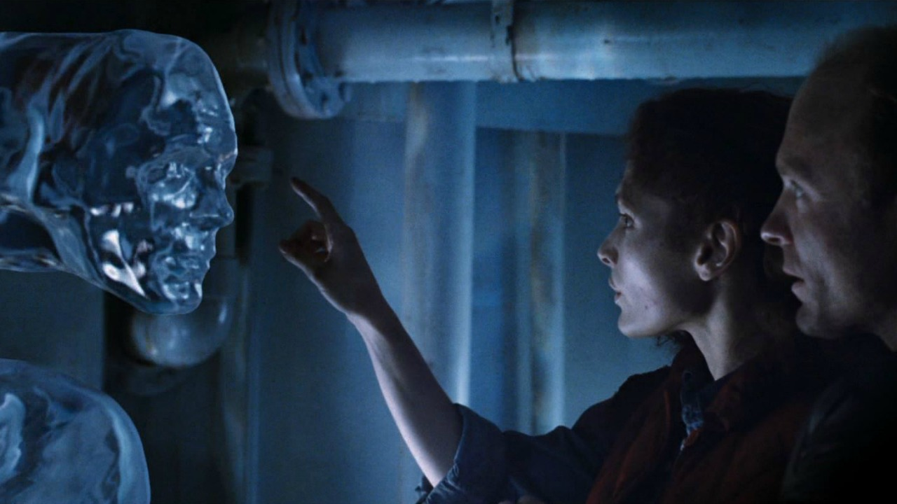
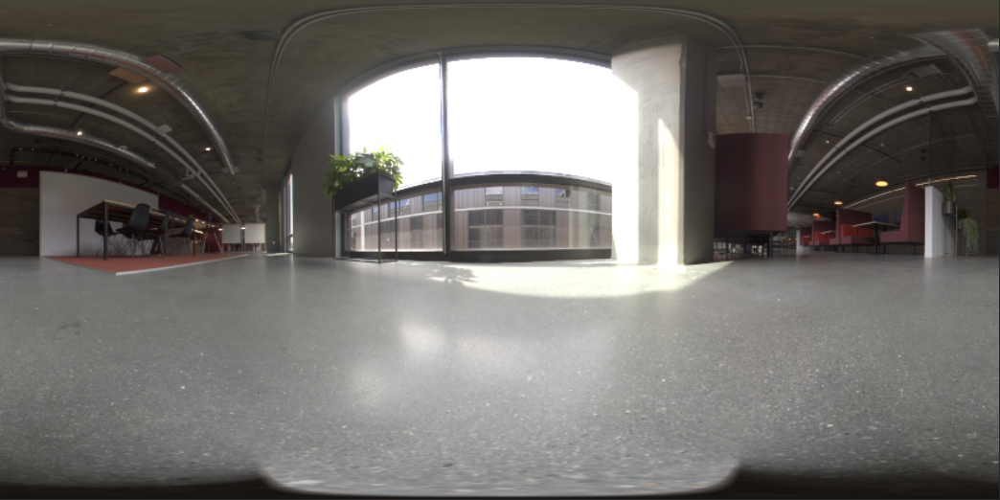
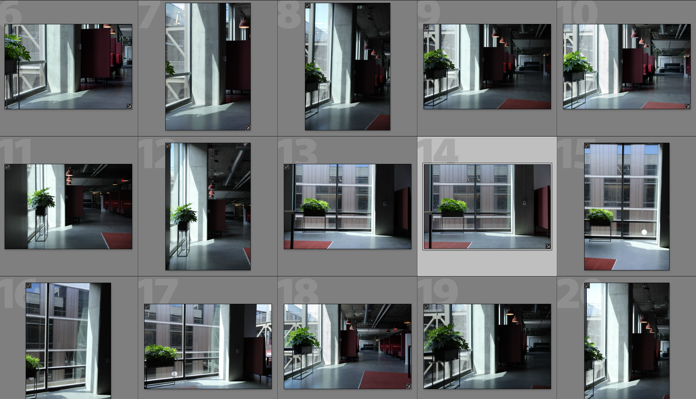

# Fotorealistische virtuele fotografie maken met 3D-rendering en -composities

![Een collage met voorbeelden van fotorealistische virtuele foto&#39;s die zijn ontworpen met Adobe [!DNL Dimension]](assets/Photorealistic_1.png)

Als je de afbeeldingen hierboven bekijkt, zou je vergeven worden dat alles wat je ziet echt is. Met de technologische vooruitgang in het renderen van fotorealistische 3D-beelden is het echter moeilijker dan ooit om te bepalen wat echt en wat virtueel is. In dit geval zijn de afbeeldingen een combinatie van echte, fotografie en gerenderde 3D-content - en dit is precies het type 3D-ontwerp waarin bedrijven investeren.

Deze techniek, van het in lagen plaatsen of het &#39;samenstellen&#39; van 3D-modellen in een afbeelding of video, is niet nieuw en de oorsprong ervan gaat terug naar de vroege dagen van VFX (tot in de jaren tachtig). Nieuw en spannend is dat deze techniek een krachtig instrument is geworden voor [Adobe [!DNL Dimension]](https://www.adobe.com/products/dimension.html) gebruikers en een intrigerende nieuwe workflow voor fotografen.

## De technologie achter het maken van samengestelde afbeeldingen in Adobe [!DNL Dimension]

![Het vlak van een metalen bol in een Adobe bewerken [!DNL Dimension] samengesteld](assets/Photorealistic_3.png)

Adobe [!DNL Dimension] heeft gebruikers in staat gesteld 2D- en 3D-elementen naadloos te combineren rechtstreeks in de app met behulp van de door Adobe Sensei aangestuurde functie voor matchafbeeldingen. Het belangrijkste voordeel van het op deze manier samenstellen van elementen is dat het turbo het proces van het creëren van een realistisch kijkend beeld door een volledig gerealiseerde 3D scène met een achtergrondbeeld te vervangen, dat van werkelijkheid kan worden gevangen.

![De functie Afbeelding afstemmen in Adobe [!DNL Dimension] analyseert de achtergrondafbeelding en schat de brandpuntsafstand en -positie van de camera die is gebruikt om deze vast te leggen](assets/Photorealistic_4.gif)

Met de functie Afbeelding afstemmen wordt de achtergrondafbeelding geanalyseerd en worden de brandpuntsafstand en -positie van de camera die is gebruikt om deze vast te leggen, geschat. Er wordt dan een 3D-camera gemaakt in het dialoogvenster [!DNL Dimension] scène die kan worden gebruikt om 3D-elementen te renderen binnen hetzelfde perspectief als de achtergrondafbeelding, zodat ze samen worden samengesteld.

Maar hoe zit het met alles wat niet is vastgelegd in het kader van de camera?  De volledige omgeving van een afbeelding wordt aanzienlijk vastgelegd, omdat deze definieert hoe alles er binnen uitziet. Een object in een afbeelding reflecteert het licht van de wereld eromheen, dat alles ook achter de camera omvat. Dus als u wilt dat de gelaagde 3D-elementen echt overvloeien in de achtergrond van uw afbeelding, moeten ze de belichting volledig weerspiegelen in de omgeving waarin de afbeelding is gemaakt.

Met Afbeelding afstemmen wordt geprobeerd de belichtingsomgeving waarin een achtergrondafbeelding is gemaakt, te &#39;hallucineren&#39;. Het levert een indrukwekkend werk op dat in korte volgorde uitstekende resultaten zal opleveren, maar het vastleggen van het milieu samen met het achtergrondbeeld zal nog realistischer resultaten opleveren. Dit is zelfs de methode die wordt gebruikt om de Adobe Sensei-functie te trainen om het zelf te doen.

Maak kennis met de wereld van 360° HDR-panorama-afbeeldingen. Deze afbeeldingen worden al lang gebruikt in 3D-afbeeldingen om de belichtingseffecten van een volledige werkomgeving te versnellen. Het proces om ze in het verleden vast te leggen is behoorlijk ingewikkeld geweest, vanwege de grote kennis en specialisaties die nodig zijn om ze te maken. Met de komst van 360°-camera&#39;s is het nu beter dan ooit om deze afbeeldingen te maken.

Camera&#39;s als de Ricoh Theta, Gopro MAX en Insta 360 kunnen 360 panorama&#39;s vastleggen. De Ricoh Theta heeft een ingebouwde automatische belichtingsbracketing die een belangrijk onderdeel is van het vastlegproces. Dit verkort de tijd en moeite om HDR&#39;s vast te leggen en maakt deze gemakkelijker toegankelijk voor fotografen.

## Het proces voor het maken van fotorealistische samengestelde afbeeldingen

### [!DNL Capture]

Om de compositie van omgevingen te beginnen, hebt u twee hoofdelementen nodig: een achtergrondafbeelding of -afbeeldingen van hoge kwaliteit en een HDR-panorama van 360° van de omgeving waarin deze is gemaakt.

Een van de belangrijkste aspecten van het effectief vastleggen van dit type inhoud is om gebruik te maken van de bestaande vaardigheden en tools van een fotograaf. Om een prachtige achtergrondafbeelding te maken, hebt u oog nodig voor de compositie en de aandacht voor details. De achtergrondafbeeldingen vereisen ook een speciale denkwijze om iets te maken dat handig is om 3D-elementen samen te stellen.

### Een locatie kiezen

Zoek locaties die interessant zijn voor zowel de context als de belichting. Als je nadenkt over de context, kan het handig zijn om je voor te stellen wat het mogelijke gebruik van een scène is. Een weergave van een lege weg kan bijvoorbeeld worden gebruikt voor het toevoegen van een 3D-auto terwijl een weergave van een tafel in een koffiehuis kan worden gebruikt voor [weergeven, pakket](https://www.adobe.com/products/dimension/packaging-design-mockup.html) van levensmiddelen.

Bij het vastleggen van de achtergrondafbeelding moet u er rekening mee houden dat er 3D-elementen in worden samengesteld. Er moet een leeg focusgebied zijn om ruimte vrij te laten voor deze objecten. De 3D-inhoud zal vaak het belangrijkste aandachtspunt van de uiteindelijke compositie zijn, dus het is belangrijk dat de achtergrond zich niet al te sterk onderscheidt.

Even belangrijk is de belichtingssituatie in de afbeelding, omdat dit van grote invloed is op de samengestelde 3D-inhoud. Het licht moet in de opname komen vanaf de schouder of de zijkant. Dit levert de beste resultaten op, omdat het een belangrijk licht is wanneer 3D-objecten in de scène worden geplaatst. Het kan verleidelijk zijn om naar het licht te schieten als er geen scherpstellingselement in beeld is, maar onthoud dat dit zal resulteren in inhoud die altijd achteruitgaat. Het toevoegen van een tijdelijk, inzetobject aan de scène kan handig zijn voor het samenstellen en beoordelen van de belichting.

## Het HDR-pano vastleggen

### Cameraplaatsing

Plaats uw camera van 360° in het algemene midden van het gebied waar u zich op richt voor het vastleggen van de achtergronden. Het kan ideaal zijn als de achtergronden een bredere scène vertonen om de camera met een monopod van de grond te tillen, anders kan de camera rechtstreeks op de grond worden geplaatst.

### Color

Het is heel belangrijk dat de kleuren behouden blijven tussen de camera waarmee de omgeving is gemaakt en de camera waarmee de achtergrond is gemaakt, omdat de afbeeldingen samen worden gebruikt. Hier hebben we zowel de kleurtemperatuur van de camera&#39;s ingesteld op 5000 k als een foto van een kleurengrafiek met beide camera&#39;s voor verdere uitlijning in de post.

### Gescheurde belichtingswaarden

Om een HDR-omgeving te creëren met de 360°-camera, moeten verschillende EV&#39;s worden vastgelegd om te worden gecombineerd in een HDR-afbeelding. De hoeveelheid EV&#39;s is niet gestandaardiseerd, maar doorgaans wilt u dat het hogere uiteinde van het belichtingsbereik uitkomt op een punt waar de schaduwen en het onderste uiteinde van het belichtingsbereik geen informatie meer bevatten, zodat er geen informatie meer is in de hooglichten.

Idealiter heeft de 360°-camera een automatische bracketing-functie waarmee de verschillende belichtingen in een batch door de camera kunnen worden geplaatst. De ideale instellingen zijn om de laagste ISO-waarde te gebruiken die beschikbaar is om ruis te voorkomen en een hoge lenswaarde voor scherpte te gebruiken. De belichtingswaarden kunnen vervolgens worden gevarieerd aan de hand van de sluitersnelheid en worden opgesplitst in stops; de belichting wordt gehalveerd of verdubbeld.

Hier is een voorbeeld van EV&#39;s die worden gebruikt voor het maken van een IBL buiten:

01 - F 5.6, ISO 80, Sluitersnelheid 1/25000, WB 5000 K

02 - F 5.6, ISO 80, Sluitersnelheid 1/12500, WB 5000 K

03 - F 5.6, ISO 80, Sluitersnelheid 1/6400, WB 5000 K

...

16 - F 5.6, ISO 80, Sluitersnelheid 1, WB 5000 K

Als de 360° die wordt gebruikt RAW-afbeeldingen kan uitvoeren, kunnen de EV&#39;s worden gesplitst in stappen van 2 tot 4 stops, omdat ze meer informatie behouden dan 8-bits afbeeldingen zoals JPEG.

Nadat u de kleuren van de EV&#39;s hebt aangepast, kunnen deze tijdelijk worden geëxporteerd naar afzonderlijke bestanden om vervolgens te worden samengevoegd in Photoshop. Het bestandstype moet afhankelijk zijn van de bron, maar gebruik in geen van beide gevallen een gecomprimeerde indeling zoals JPEG. Gebruik in Photoshop Bestand > Automatisch > Samenvoegen tot HDR Pro... en selecteer alle geëxporteerde EV&#39;s.

Zorg ervoor dat Modus is ingesteld op 32 bits. Het gebruik van &#39;verwijder schimmen&#39; kan helpen details te verwijderen die tussen de EVs veranderen, maar gebruik het niet als u het niet nodig hebt. De schuifregelaar onder het histogram heeft alleen invloed op de belichting van de voorvertoning, dus negeert u deze. Schakel &#39;Volledige kleurtinten in Adobe Camera Raw&#39; uit en druk op OK.

Het resultaat is een HDR-afbeelding die kan worden gebruikt om scènes in 3D te belichten.

De laatste stappen zijn het verwijderen van eventuele schaduwen en driepuntsbenen die zichtbaar zijn aan de onderkant van de afbeelding en het aanpassen van de standaardbelichting van de afbeelding om de scène correct te belichten. U kunt de details verwijderen met het gereedschap Klonen in Photoshop. De blootstelling moet worden aangepast in samenhang met de achtergronden in [!DNL Dimension], aangezien de belichtingswaarde van de HDR IBL de belichtingswaarden van de 3D-objecten is.

### Achtergronden vastleggen

Nadat u de omgeving hebt vastgelegd, kunt u nu achtergronden vastleggen met een camera van uw keuze. Hoe hoger de kwaliteit en hoe hoger de resolutie, hoe beter. Dit is, samen met een oog voor compositie die fotografen hebben, het belangrijkste voordeel van dit proces. De bovenstaande afbeeldingen zijn vastgelegd met een Canon 5D MK IV.

Er is veel ruimte voor het ontwerpen en samenstellen met de achtergronden. De camera kan een hoge of lage lensopening hebben voor een gevarieerde scherptediepte, lange of korte brandpuntsafstanden gebruiken en een hoek omhoog of omlaag maken. De belangrijkste vereiste is dat de camera gericht is op het middelpunt van waar de omgeving werd vastgelegd met de 360 camera.

Wanneer het vastleggen is voltooid, moeten de afbeeldingen na verwerking worden verwerkt, zodat ze zo dicht mogelijk in de kleur van de omgeving passen. De kleur en de belichting moeten zo neutraal en natuurlijk mogelijk zijn. Eventuele gestileerde vormgevingen moeten worden toegepast nadat 3D-elementen in de afbeelding zijn samengesteld met Adobe [!DNL Dimension].

## Samengestelde afbeelding samenstellen in [!DNL Dimension]

Deze elementen zijn verzameld en voltooid en kunnen nu worden samengevoegd in een scène in Adobe [!DNL Dimension]. Dit is net zo eenvoudig als het slepen van de achtergrond naar de scène, waarna deze wordt toegepast op de achtergrond. Voeg vervolgens het HDR-deelvenster toe aan de sleuf voor de afbeelding van het achtergrondlicht.

Sleep de achtergrondafbeelding naar een leeg gedeelte van het canvas of selecteer de omgeving in het deelvenster Scène en voeg de afbeelding toe aan de achtergrondinvoer.

![De achtergrondafbeelding voor een virtuele foto kan worden geselecteerd in het menu Eigenschappen in Adobe [!DNL Dimension]](assets/Photorealistic_20.png)

Voeg het HDR-pano toe door Omgevingslicht te selecteren en toe te voegen aan de afbeeldingsinvoer.

![De omgevingslichtbron kan aan de achtergrondafbeelding van een virtuele foto worden toegevoegd via het menu Scène in Adobe [!DNL Dimension]](assets/Photorealistic_21.png)

U kunt vervolgens Afbeelding afstemmen op de achtergrond gebruiken om deze af te stemmen op zowel de resolutie en het aspect als het perspectief van de camera. In plaats van de omgeving te genereren op basis van de achtergrondafbeelding, wordt de vastgelegde HDR-panorama gebruikt om de scène te belichten, zodat de optie Lichten maken niet is ingeschakeld.

![De functie Afbeelding afstemmen gebruiken in Adobe [!DNL Dimension] om een afbeelding van een 3D-metaalbol te renderen met de omgevingslichten van een HDR-panorama](assets/Photorealistic_22.png)

Objecten die in de scène worden toegevoegd, worden op realistische wijze op de achtergrond samengesteld, omdat ze worden belicht door de omgeving waarin de afbeelding is gemaakt.

Om de richting en belichting van het HDR-pano snel te kunnen bepalen ten opzichte van de achtergrond, is een bol primitief met een metaal materiaal, genomen uit het deelvenster met vrije elementen in [!DNL Dimension]kan in de scène worden geplaatst. De rotatie van het omgevingslicht kan vervolgens worden geplaatst, zodat de reflecties er correct uitzien. Als de belichting van het HDR-panorama boven of onder de bol valt, moet de belichting van het HDR-panorama worden verhoogd of verlaagd ter compensatie.

Om de richting en belichting van het HDR-pano snel te kunnen bepalen ten opzichte van de achtergrond, is een bol primitief met een metaal materiaal, genomen uit het deelvenster met vrije elementen in [!DNL Dimension]kan in de scène worden geplaatst. De rotatie van het omgevingslicht kan vervolgens worden geplaatst, zodat de reflecties er correct uitzien. Als de belichting van het HDR-panorama boven of onder de bol valt, moet de belichting van het HDR-panorama worden verhoogd of verlaagd ter compensatie.

## Het eindresultaat: een fotorealistische samengestelde afbeelding

![Een time-lapse van 3D-compositie en -rendering voor een virtuele productfoto in Adobe [!DNL Dimension]](assets/Photorealistic_24.gif)

Zodra de scène is voltooid, is de workflow voor de eindgebruiker eenvoudig. Je kunt gewoon je eigen model of een ander model slepen [Adobe [!DNL Stock] 3D](https://stock.adobe.com/3d-assets) rechtstreeks in de afbeelding om deze weer te geven alsof deze er was toen de foto werd gemaakt. Dit opent nieuwe mogelijkheden voor het creëren van zeer realistische advertentie-inhoud, of de mogelijkheid om op ontwerpen binnen vele verschillende contexten te herhalen.

Het eindresultaat is een overtuigende combinatie van realiteit en 3D waarmee eindgebruikers het doel van het maken van fotorealistische afbeeldingen met minimale inspanningen kunnen bereiken. Probeer het zelf met een paar [gratis [!DNL Dimension] scènes](https://assets.adobe.com/public/3926726a-2a17-43d4-4937-6d84a4d29338) hebben we gemaakt om de workflow te demonstreren.

[Download de nieuwste release](https://creativecloud.adobe.com/apps/download/dimension) van [!DNL Dimension] en maak nu je fotorealistische afbeeldingen.
