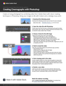

# Films maken met Photoshop

In deze stapsgewijze videozelfstudie voor workshops maakt u een levende foto door video van Adobe te combineren [!DNL Stock] met slimme maskertechnieken in Photoshop.

>[!VIDEO](https://video.tv.adobe.com/v/331002?hidetitle=true)

  

[**Download Quick Reference PDF Guide**](../quick-reference/CreatingCinemagraphswithPhotoshop.pdf)

