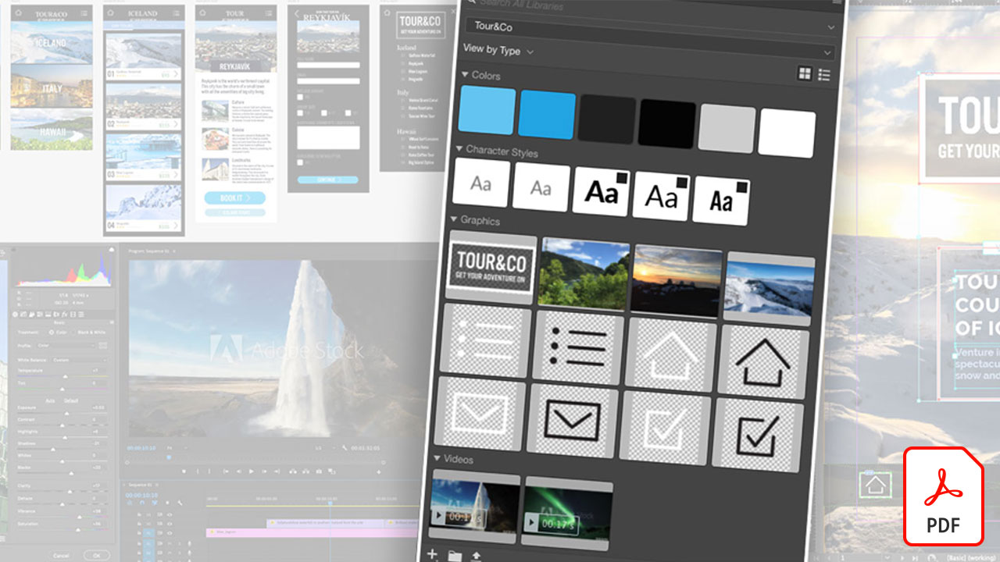
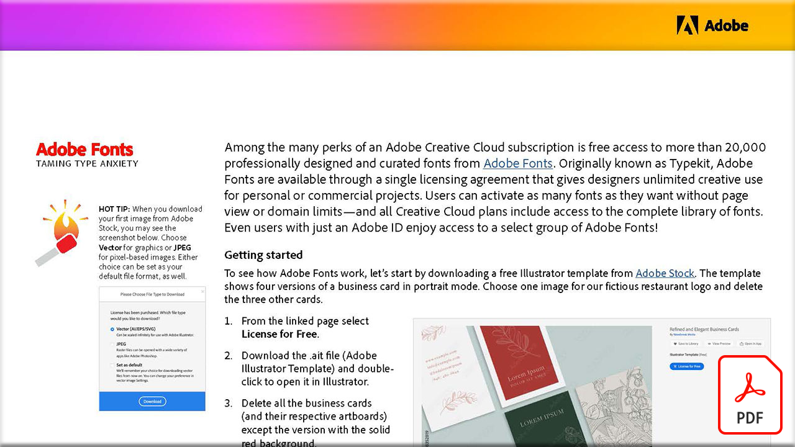
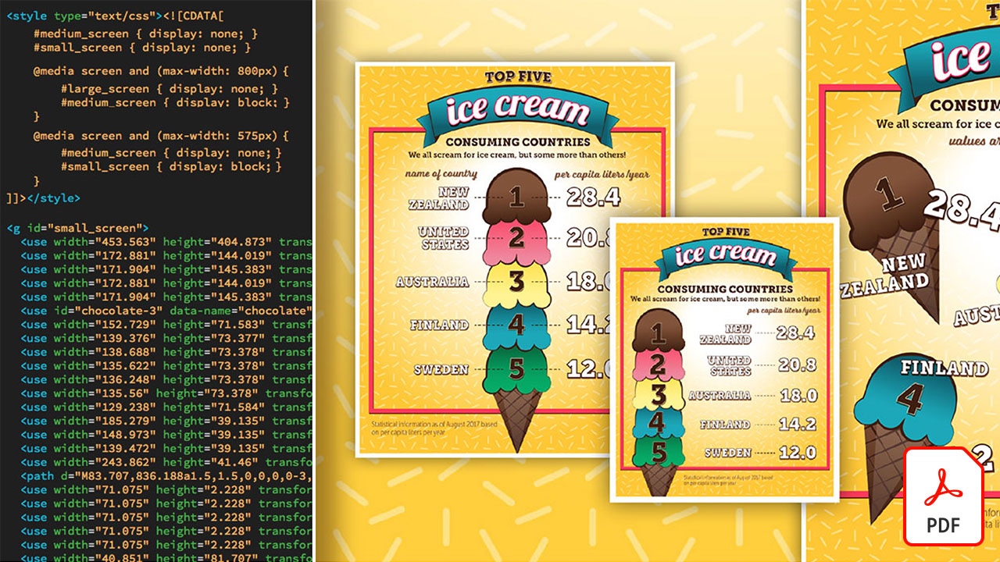

# Zelfstudies voor Creative Cloud voor ondernemingen

Als creatief bedrijf moet je samenwerken met gedistribueerde teams, schaalbare processen instellen en voldoen aan bedrijfssystemen en richtlijnen. Deze zelfstudies helpen u nieuwe functies in Creative Cloud te leren - vanuit het perspectief van de onderneming.

## Klik om een productzelfstudie weer te geven (weergegeven in alfabetische volgorde)

### Adobe Acrobat

<table style="table-layout:fixed">
<tr>
 <td>
   
    

   <a href="acrobat-content-creators.md"><strong>Acrobat for content creators (PDF)</strong></a>
    

    <em>Meer informatie over de Acrobat-tools waarmee je creatieve workflows kunt stroomlijnen</em>
     
  </td>
  <td>
    
    

     
  </td>
  <td>
    
    

     
  </td>
  <td>
    
    

     
  </td>
</tr>
</table>

### Adobe Express (voorheen Adobe Spark)

<table style="table-layout:fixed">
<tr>
 <td>
   
    

   <a href="adobe-express-content-that-stands-out.md"><strong>Adobe Express: Content die opvalt</strong></a>
    

    <em> Creëer binnen enkele minuten prachtige graphics, webpagina’s en videoverhalen met Adobe Express</em>
     
  </td>
  <td>
   
    

   <a href="assets/CreatingYourBrandinAdobeSpark.pdf"><strong>Uw merk maken in Adobe Spark (PDF)</strong></a>
    

    <em>Met Adobe Spark kun je eenvoudig je merk definiëren</em>
     
  </td>
  <td>
   
    

   <a href="assets/AddingaGlideshowtoyourSparkPageAdobeBlog.pdf"><strong>Een presentatie toevoegen aan uw Spark Page (PDF)</strong></a>
    

    <em>Adobe Spark biedt een aantal fantastische en gebruiksvriendelijke lay-outcomponenten die je webverhalen tot leven brengen</em>
     
  </td>
  <td>
   
    

   <a href="assets/CreatingYourBrandinAdobeSpark.pdf"><strong>Uw merk maken in Adobe Spark (PDF)</strong></a>
    

    <em>Met Adobe Spark kun je eenvoudig je merk definiëren</em>
     
  </td>
  <td>
   
    

   <a href="assets/MeetYourNewProductionArtistAdobeSparkPost.pdf"><strong>Maak kennis met je nieuwe productieartiest: Adobe Spark Post (PDF)</strong></a>
    

    <em>Adobe Spark leert van u terwijl u lay-outs maakt, kleuren definieert, illustraties importeert en elementen rangschikt in uw composities</em>
     
  </td>
</tr>
</table>

### Adobe Portfolio

<table  style="table-layout:fixed">
<tr>
   <td>
   
    

   <a href="assets/GettingStartedWithAdobePortfolio.pdf"><strong>Aan de slag met Adobe Portfolio (PDF)</strong></a>
    

    <em>Uw beste werk delen met Adobe Portfolio is een effectieve manier om uw succes te delen en nieuw creatief talent aan te trekken</em>
     
  </td>
  <td>
   
    

   <a href="assets/ConnectingLightroomandBehancetoYourAdobePortfolio.pdf"><strong>Lightroom en Bēhance aansluiten op uw Adobe Portfolio (PDF)</strong></a>
    

    <em>Bēhance-projecten gebruiken als pagina's in uw portfolio</em>
     
  </td>
  <td>
   
    

   <a href="assets/ShowYourBestWorkwithAdobePortfolio.pdf"><strong>Uw beste werk tonen met Adobe Portfolio (PDF)</strong></a>
    

    <em>Met Adobe Portfolio kun je je werk uploaden, ordenen en delen met potentiële medewerkers en klanten over de hele wereld</em>
     
  </td>
  <td>
    
    

     
  </td>
 </tr>
 </table>

### CC Libraries

<table  style="table-layout:fixed">
<tr>
  <td>
   
   

   <a href="cc-workflows-cc-libraries.md"><strong>CC-workflows verbeteren met CC Libraries (PDF)</strong></a>
    

    <em>Leer hoe Creative Cloud Libraries ontwerpelementen bij elkaar houden - om projectconsistentie voor ontwerpers en teams te verzekeren</em>
     
  </td>
  <td>
   
   

   <a href="ccteamlibraries.md"><strong>Creative Cloud-bibliotheken maken voor teams</strong></a>
    

    <em>Leer hoe je assets deelt binnen een groep of team met behulp van Creative Cloud Libraries voor teams</em>
     
  </td>
  <td>
   
   

   <a href="sharecclibraries.md"><strong>Branding-assets delen met Creative Cloud Libraries voor teams</strong></a>
    

    <em>Leer hoe je branding-assets voor je groep of team creëert, gebruikt en deelt met Creative Cloud Libraries voor teams</em>
     
  </td>
  <td>
   
    

   <a href="assets/CreateAddandShareYourBrandAssetswithCreativeCloudLibraries.pdf"><strong>Creëer, voeg en deel je merkassets met Creative Cloud Libraries (PDF)</strong></a>
    

    <em>Creative Cloud Libraries biedt een ingebouwd merksysteem waarmee ontwerpers merkassets kunnen delen met verschillende creatieve teams</em>
     
  </td>
  </tr>
  <tr>
  <td>
   
    

   <a href="assets/ShareTextStylesFromIllustratorwithCreativeCloudLibraries.pdf"><strong>Tekststijlen delen vanuit Illustrator met Creative Cloud-bibliotheken (PDF)</strong></a>
    

    <em>Werk slimmer, niet harder in Illustrator</em>
     
  </td>
  <td>
    
    

     
  </td>
  <td>
    
    

     
  </td>
  <td>
    
    

     
  </td>
</tr>
</table>

### Creative Cloud voor ondernemingen

<table style="table-layout:fixed">
<tr>
 <td>
   
    

   <a href="collaboration-the-future-of-creativity.md"><strong>Samenwerking: De toekomst van creativiteit</strong></a>
    

    <em>Een van de vele risico's van een Adobe Creative Cloud-lidmaatschap is gratis toegang tot meer dan 20.000 professioneel ontworpen en beheerde lettertypen van Adobe Fonts</em>
     
  </td>
  <td>
   
    

   <a href="assets/FromHandLetteringtoIllustratorviaCreativeCloud.pdf"><strong>Van Hand Lettering naar Illustrator via Creative Cloud (PDF)</strong></a>
    

    <em>Met de kracht van Creative Cloud voor ondernemingen, kun je met de mobiele apps van Adobe en desktop overal vastleggen, converteren en creëren - op elk apparaat</em>
     
  </td>
  <td>
   
    

   <a href="assets/FromLightroomWebtoInDesignviaCreativeCloud.pdf"><strong>Van Lightroom Web naar InDesign via Creative Cloud (PDF)</strong></a>
    

    <em>Til je creativiteit van de camera naar het uiteindelijke ontwerp met Creative Cloud-bestanden en -bibliotheken</em>
     
  </td>
</tr>
</table>

### [!DNL Dimension]

<table  style="table-layout:fixed">
<tr>
   <td>
   
    

   <a href="assets/VisualizeyourProductinaRealisticEnvironment.pdf"><strong>Visualiseer uw product in een realistische omgeving (PDF)</strong></a>
    

    <em>Als je wilt zien hoe je producten eruitzien in de echte wereld, Adobe [!DNL Dimension] is uw startende app</em>
     
  </td>
  <td>
    
    

     
  </td>
  <td>
    
    

     
  </td>
  <td>
    
    

     
  </td>
</tr>
</table>

### Fresco

<table>
<tr>
 <td>
   
    

   <a href="frescoworkshop.md"><strong>Probeer uw hand op Fresco op de iPad (en iPhone)</strong></a>
    

    <em>Ontdek een hele nieuwe wereld van digitaal tekenen en schilderen met Adobe Fresco in deze praktische workshop van 15 minuten</em>
     
  </td>
  <td>
    
    

     
  </td>
  <td>
    
    

     
  </td>
  <td>
    
    

     
  </td>
</tr>
</table>

### Fonts

<table  style="table-layout:fixed">
<tr>
<td>
   
    

   <a href="taming-type-anxiety.md"><strong>Angst voor type games (PDF)</strong></a>
    

    <em>Leer hoe u meer dan 20.000 professioneel ontworpen lettertypen in Creative Cloud benadert en gebruikt</em>
     
  </td>
  <td>
   
    

   <a href="assets/CreatingBeautifulTypographywithCreativeCloud.pdf"><strong>Creëer prachtige typografie met Creative Cloud (PDF)</strong></a>
    

    <em>Leer de geavanceerde typografische besturingselementen van uw favoriete ontwerptools te benutten</em>
     
  </td>
   <td>
   
    

   <a href="assets/DiscoveringFontswithCreativeCloud.pdf"><strong>Lettertypen ontdekken met Creative Cloud (PDF)</strong></a>
    

    <em>Het vinden van het juiste lettertype voor een project kan soms overweldigend lijken. Met verschillende Creative Cloud-apps en -services is het nu leuk en inspirerend om het juiste lettertype te vinden</em>
     
  </td>
  <td>
   
    

   <a href="assets/UnleashHiddenGemsinOpenTypefonts.pdf"><strong>Verborgen OpenTypen ontgrendelen in lettertypen (PDF)</strong></a>
    

    <em>Met de indeling OpenType kan een lettertype maximaal 65.536 glyphs bevatten</em>
     
  </td>
</table>

### Illustrator

<table  style="table-layout:fixed">
<tr>
   <td>
   
    

   <a href="assets/GettoKnowGraphicStylesinIllustrator.pdf"><strong>Kennismaken met afbeeldingsstijlen in Illustrator (PDF)</strong></a>
    

    <em>Illustrator biedt je de mogelijkheid om illustraties op dezelfde manier op te maken als je tekst opmaakt</em>
     
  </td>
   <td>
   
    

   <a href="assets/WorkSmarterNotHarderwithIllustrator.pdf"><strong>Werk slimmer, niet moeilijker, met Adobe Illustrator CC (PDF)</strong></a>
    

    <em>Versnel je vectortekeningen in Illustrator</em>
     
  </td>
  <td>
   
    

   <a href="assets/IllustratorSymbolsandLayersequalsPerfectStructureforResponsiveSVG.pdf"><strong>Illustrator-symbolen + lagen = Perfecte structuur voor responsieve SVG! (PDF)</strong></a>
    

    <em>Illustrator biedt ongeëvenaarde ondersteuning voor de SVG-indeling, waaronder de mogelijkheid om symbolen, groepen, id's en exacte vectordefinities van uw illustraties te maken</em>
     
  </td>
  <td>
    
    

     
  </td>
</tr>
</table>

### InDesign

<table  style="table-layout:fixed">
<tr>
  <td>
   
    

   <a href="assets/CreatingInteractivePDFsfromInDesign.pdf"><strong>Interactieve PDF maken vanaf InDesign (PDF)</strong></a>
    

    <em>InDesign bevat veel functies waarmee u de inhoud in uw documenten kunt opmaken, opmaken, beheren en bijhouden</em>
     
  </td>
   <td>
   
    

   <a href="assets/EasilyGatherandIncorporateDesignFeedbackwithAdobeAcrobatandInDesign.pdf"><strong>Eenvoudig ontwerpfeedback verzamelen en opnemen met Adobe Acrobat en InDesign (PDF)</strong></a>
    

    <em>Belanghebbenden kunnen Acrobat gebruiken om gedetailleerde opmerkingen en annotaties toe te voegen. Vervolgens kunt u deze markeringen snel terugbrengen naar Adobe InDesign om ze te zien in de context van uw layout</em>
     
  </td>
  <td>
   
    

   <a href="assets/StyleWebContentwithInDesign.pdf"><strong>Webinhoud opmaken met Adobe InDesign CC (PDF)</strong></a>
    

    <em>Wist u dat u de kracht van InDesign kunt benutten voor het uitvoeren van HTML- en webafbeeldingen?</em>
     
  </td>
  <td>
   
    

   <a href="assets/InteractivePDFBookmarksandLinkedTOCsfromInDesign.pdf"><strong>Interactieve PDF: Bladwijzers en gekoppelde inhoudsopgave's uit InDesign (PDF)</strong></a>
    

    <em>Leer hoe u met de functie Inhoudsopgave in InDesign bladwijzers en hyperlinks genereert waarmee uw lezers snel informatie in uw PDF-bestanden kunnen vinden</em>
     
  </td>
</tr>
<tr>
  <td>
   
    

   <a href="assets/InteractivePDFGraphicalHyperlinksandNestedMasterPagesinInDesign.pdf"><strong>Interactieve PDF: Grafische hyperlinks en geneste stramienpagina's in InDesign (PDF)</strong></a>
    

    <em>Door hyperlinks toe te passen op stramienpagina's kunt u snel een navigatiesysteem beheren op al uw pagina's</em>
     
  </td>
  <td>
    
    

     
  </td>
  <td>
    
    

     
  </td>
  <td>
    
    

     
  </td>
</tr>
</table>

### Photoshop

<table style="table-layout:fixed">
<tr>
  <td>
    
    

    <a href="alphabetsoup.md"><strong>Het alfabetsoep van grafische indelingen decoderen</strong></a>
    

    <em>JPG-, PNG-, SVG-, GIF- en EPS-bestanden worden veel gebruikt in ontwerpen, sommige voor webpagina's, andere voor presentaties, publicaties en creatieve projecten. Maar wat bedoelen ze, en welke moet je kiezen?</em>
     
  </td>
  <td>
    
    

    <a href="compositepsipad.md"><strong>Unieke composities maken met Adobe [!DNL Stock] en Photoshop voor iPad</strong></a>
    

    <em>Benut de kracht van Photoshop binnen handbereik. Leer hoe je een van je favoriete Creative Cloud-applicaties op een geheel nieuwe manier gebruikt, met een vernieuwde, aanraakgebaseerde interface</em>
     
  </td>
  <td>
    
    

    <a href="cinemagraphps.md"><strong>Cinemagraps maken met Photoshop</strong></a>
    

    <em>In deze stapsgewijze videozelfstudie voor een workshop maakt u een levende foto door video van Adobe te combineren [!DNL Stock] met slimme maskertechnieken in Photoshop</em>
     
  </td>
  <td>
    
    

    <a href="assets/AddRemarkableLightingtoaPhotowithPhotoshopandAfterEffects.pdf"><strong>Fantastische belichting toevoegen aan een foto met Photoshop en After Effects (PDF)</strong></a>
    

    <em>Leer het effect Lichtexplosie in Adobe After Effects gebruiken om een foto drastisch te verbeteren</em>
     
  </td>
</tr>
<tr>
  <td>
    
    

    <a href="assets/CreateCinemagraphsinaSnapwithPhotoshopandAdobeStock.pdf"><strong>Creëer in een mum van tijd Cinemagraps met Photoshop en Adobe [!DNL Stock] (PDF)</strong></a>
    

    <em>Zoeken naar video's die naadloos worden herhaald op Adobe [!DNL Stock] voor het snel samenstellen van opvallende bioscopen in Photoshop</em>
     
  </td>
  <td>
    
    

    <a href="assets/CreatingaLivingPhotographwithPhotoshopPart1.pdf"><strong>Een levende foto maken met Photoshop — Deel 1 (PDF)</strong></a>
    

    <em>Met Adobe Photoshop kun je snel je korte video’s omzetten in levende foto’s die je doelgroep op elk social-mediaplatform fascineren</em>
     
  </td>
  <td>
    
    

    <a href="assets/CreatingaLivingPhotographwithPhotoshopPart2.pdf"><strong>Een levende foto maken met Photoshop — Deel 2 (PDF)</strong></a>
    

    <em>Het combineren van foto's met video is een krachtige manier om een aantrekkelijke kwaliteit aan uw foto's toe te voegen zonder dat dit ten koste gaat van het bericht of de toon van uw oorspronkelijke afbeelding</em>
     
  </td>
  <td>
    
    

    <a href="assets/PhotoshopAfterEffectsAwesomenessAdobeMAX2018LabRecap.pdf"><strong>Photoshop + After Effects = Bewestheid: Adobe MAX 2018 Lab Recap (PDF)</strong></a>
    

    <em>In dit praktijkgerichte, stapsgewijze laboratorium, combineer Photoshop met After Effects om verbluffende beelden en gevolgen tot stand te brengen geschikt voor gebruik in om het even welk middel</em>
     
  </td>
</tr>
<tr>
  <td>
    
    

    <a href="assets/QuicklyBrandYourInstagramPhotoswithAdobePhotoshopActions.pdf"><strong>Snel uw Instagram-foto's voorzien van Adobe Photoshop-handelingen (PDF)</strong></a>
    

    <em>Elimineer het medium en bespaar veel tijd door Handelingen in Photoshop te gebruiken</em>
     
  </td>
  <td>
    
    

    <a href="assets/WorkSmarterNotHarderwithPhotoshop.pdf"><strong>Werk slimmer, niet harder, met Photoshop (PDF)</strong></a>
    

    <em>Wijzigingen in Photoshop kunnen tijdrovend zijn, maar dat hoeft niet</em>
     
  </td>
  <td>
    
    

    <a href="assets/AnyoneCanBeCreativewithAdobeCreativeCloud.pdf"><strong>Voeg een kleine Adobe Photoshop toe aan uw creatieve vaardigheidsset (PDF)</strong></a>
    

    <em>Voeg een kleine Adobe Photoshop toe aan uw creatieve vaardigheidsset</em>
     
  </td>
  <td>
    
    

    <a href="assets/GreenScreenisNotJustforVideo.pdf"><strong>Groen scherm is niet alleen voor video (PDF)</strong></a>
    

    <em>U kunt het groene scherm in een fotostudio gebruiken en After Effects gebruiken om het fotogebruik in Photoshop voor te bereiden</em>
     
  </td>
</tr>  
</table>
