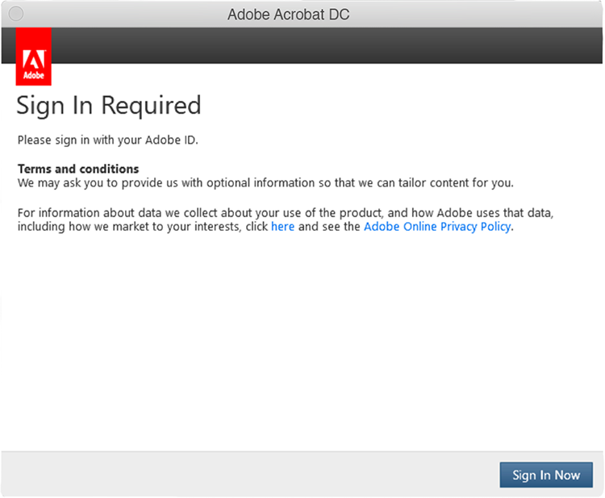

# Werken met verlopen van Creative Cloud voor ondernemingen en Acrobat-serienummers

In het verleden heeft Adobe serienummers met onze apps (d.w.z. Creative Suite, Creative Cloud voor ondernemingen, Acrobat XI, Acrobat DC) uitgegeven aan klanten met Enterprise Term License Agreements (ETLA). Deze serienummers hebben een vervaldatum. Nadat de vervaldatum is verstreken, werkt het product niet meer. Het is daarom belangrijk dat u de migratie plant voordat uw serienummers verlopen. Op deze pagina worden de stappen beschreven die nodig zijn om ervoor te zorgen dat uw eindgebruikers toegang kunnen blijven houden tot hun Adobe-apps en -services.

## De vervaldatum van uw serienummers controleren

### Serienummer(s) zoeken

De serienummerlicenties voor uw ETLA-overeenkomst zijn beschikbaar via de [licentiewebsite voor Adobe](https://licensing.adobe.com/) (LWS). Volg deze instructies om weer te geven en te downloaden:

1. Meld u aan bij [Licentiewebsite voor Adobe](https://licensing.adobe.com/) (LWS) met uw Adobe ID en wachtwoord.
1. Kies **Licenties > Serienummers ophalen**.
1. Voer uw **Eindgebruiker-id** of **Implementatie-naar-id** in.
1. (Optioneel) Selecteer een **Productnaam**, **Productversie** of **Platform** om resultaten te filteren.
1. Klik op Zoeken.
1. De productnaam en serienummers worden weergegeven.
1. (Optioneel) Selecteer &quot;EXPORTEREN NAAR CSV&quot; om de lijst met serienummers te downloaden.

### Controleer de vervaldatum

De [AdobeExpiryCheck](https://helpx.adobe.com/enterprise/kb/volume-license-expiration-check.html) is een opdrachtregelprogramma waarmee IT-beheerders kunnen controleren of Adobe-producten op een computer serienummers gebruiken die zijn verlopen of verlopen. Het hulpprogramma geeft informatie weer zoals de LEID (Product Licensing Identifier), het gecodeerde serienummer en de vervaldatum. Deze [pagina](https://helpx.adobe.com/enterprise/kb/volume-license-expiration-check.html) bevat instructies voor het downloaden en gebruiken van het gereedschap op Mac- of Windows-computers.

## De ervaring van eindgebruikers voor en na het verlopen van het serienummer

Zowel Acrobat- als Creative Cloud for Enterprise-apps beginnen vanaf 60 dagen voor het verlopen berichten (in de apps) weer te geven. Zodra het serienummer is verlopen, stoppen de producten met werken en vragen de gebruiker om actie te ondernemen.

### Ervaring met Creative Cloud voor ondernemingen

De volgende informatie geeft een overzicht van de gebruikerservaring. Hieronder volgt een korte video, gevolgd door een overzicht van de gebruikerservaring.

>[!VIDEO](https://video.tv.adobe.com/v/331746?hidetitle=true)

**Voor vervaldatum**

Vanaf 60 dagen voordat het serienummer verloopt, wordt in alle Creative Cloud voor bedrijfs-apps een dialoogvenster met het product in weergegeven voor de eindgebruiker. Dit bericht wordt wekelijks, tot 30 dagen voor het verlopen, weergegeven tot de vervaldatum die aangeeft dat uw licentie verloopt. *Voor dit Adobe-product wordt een licentie gebruikt die op 29 november 2020 verstrijkt. Neem contact op met uw beheerder om ervoor te zorgen dat u doorgaat met toegang*.

**Na vervaldatum**

Zodra het serienummer is verlopen, hebben de gebruikers geen toegang meer tot de Creative Cloud voor bedrijfs-apps. Wanneer de gebruiker de toepassing voor het eerst start nadat deze is verlopen, wordt een dialoogvenster weergegeven met de tekst *Het ingevoerde serienummer is verlopen. Er kan geen licentie voor dit product worden verleend. Neem contact op met de klantenondersteuning*.

Voor alle volgende pogingen om de apps te starten, wordt de eindgebruiker gevraagd **Nu aanmelden** te openen, gevolgd door de optie om een eigen Adobe ID te maken en de proefmodus te activeren. Nieuwe Adobe ID die door de eindgebruiker is gemaakt, is echter niet gekoppeld aan de licenties van uw organisatie en veroorzaakt extra verwarring voor uw gebruikers. Migreer uw gebruikers naar gebruikerslicenties op naam voordat uw serienummers verlopen, om bedrijfsonderbrekingen en/of onnodige verwarring te voorkomen.

### Acrobat Experience

De volgende informatie geeft een overzicht van de gebruikerservaring. Hieronder volgt een korte video, gevolgd door een overzicht van de gebruikerservaring.

>[!VIDEO](https://video.tv.adobe.com/v/331749?hidetitle=true)

**Voor vervaldatum**

Vanaf 60 dagen voordat het serienummer verloopt, geeft Acrobat een pop-upbericht in het product weer voor de eindgebruiker. Dit zal eenmaal per week tot 7 dagen voor het verlopen verschijnen. Het wordt dan dagelijks weergegeven met de mededeling *Uw Adobe Acrobat-licentie verloopt op 11-30-2020. Neem contact op met uw beheerder om Acrobat zonder onderbreking te blijven gebruiken.*

**Na vervaldatum**

Zodra het serienummer is verlopen, hebben de gebruikers geen toegang meer tot Acrobat. Wanneer de gebruiker de toepassing voor het eerst start nadat deze is verlopen, wordt een dialoogvenster weergegeven met de tekst *Het ingevoerde serienummer is verlopen. Er kan geen licentie voor dit product worden verleend. Neem contact op met de klantenondersteuning.*

Voor alle volgende pogingen om Acrobat te starten, wordt de eindgebruiker gevraagd **Nu aanmelden** aan te melden, gevolgd door de optie om een eigen Adobe ID te maken en de proefmodus te activeren. Nieuwe Adobe ID die door de eindgebruiker is gemaakt, is echter niet gekoppeld aan de licenties van uw organisatie en veroorzaakt extra verwarring voor uw gebruikers.

## Neem contact met ons op als u hulp nodig hebt

Als u vragen hebt over het gebruik van de [AdobeExpiryCheck](https://helpx.adobe.com/enterprise/kb/volume-license-expiration-check.html)-tool of hulp nodig hebt bij het migreren van de implementatie van serienummers naar een benoemde gebruiker, hebt u een aantal opties:
* Stuur een e-mail naar het Adobe Enterprise Onboarding-team - **entonb@adobe.com**
* Open een ondersteuningsticket in [Admin Console](https://adminconsole.adobe.com/support)
* Bereik uw Adobe Account Manager of Customer Success Manager
