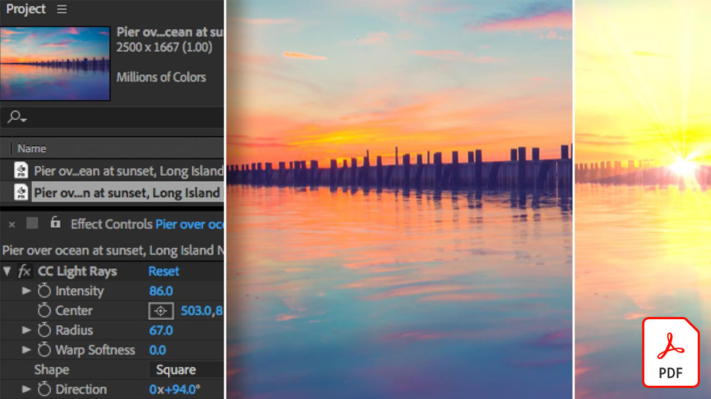

# Adobe Video-zelfstudies

Breng je ideeën tot leven met Adobe-software en -apps voor videobewerking, bewegende beelden, visuele effecten, animatie en meer.

## Klik om een Adobe-videozelfstudie te bekijken

<table>
<tr>
 <td>
   
    

   <a href="assets/AfterEffectsforPhotography.pdf"><strong>After Effects for Photography (PDF)</strong></a>
    

    <em>Leer hoe u de verbluffende effecten in After Effects kunt gebruiken om uw foto's te verbeteren</em>
     
  </td>
  <td>
   
    

   <a href="assets/CinemagraphsTheMesmerizingPlaceBetweenaPhotoandaVideo.pdf"><strong>Cinemagraphs: De Mesmerizing-plaats tussen een foto en een video (PDF)</strong></a>
    

    <em>Meer informatie over cinemagraphs — die opvallende hybriden die ergens tussen een foto en een video bestaan</em>
     
  </td>
  <td>
   
    

   <a href="assets/CreateanIllustrationfromanAdobeStockPhotowithAfterEffects.pdf"><strong>Een illustratie maken van een Adobe [!DNL Stock] Foto met After Effects (PDF)</strong></a>
    

    <em>Combineer de effecten Kleurtoon/verzadiging en Niveaus met de Cartoon-effecten in After Effects om een unieke gestileerde illustratie te maken van een Adobe [!DNL Stock]-foto</em>
     
  </td>
</tr>
<tr>
 <td>
   
    

   <a href="assets/CreateAnimatedTitlesUsingMotionGraphicsTemplatesinAdobePremiereRush.pdf"><strong>Geanimeerde titels maken met sjablonen voor bewegende beelden in Adobe Premiere [!DNL Rush] (PDF)</strong></a>
    

    <em>Laat je video's er nog verbluffender uitzien door professioneel ontworpen sjablonen voor bewegende beelden toe te voegen die passen bij je verhaal of die passen bij je persoonlijke merk</em>
     
  </td>
  <td>
   
    

   <a href="assets/CreateBeautifulKaleidoscopePatternswithAfterEffects.pdf"><strong>Prachtige Kaleidoscooppatronen maken met After Effects PDF)</strong></a>
    

    <em>Creëer een oneindig aantal patronen en structuren, van elke afbeelding, met behulp van het CC Kaleida-effect in Adobe After Effects</em>
     
  </td>
  <td>
   
    

   <a href="assets/CreateIntricateTransparencyinyourPhotographswithKeyinginAfterEffects.pdf"><strong>Maak ingewikkelde transparantie in je foto’s met Keying in After Effects (PDF)</strong></a>
    

    <em>Keying wordt veel gebruikt voor video, maar kan ook een grote hulp zijn wanneer uw foto's nodig zijn voor ontwerpprojecten</em>
     
  </td>
</tr>
<tr>
 <td>
   
    

   <a href="assets/DazzlingLightEffectsforPhotographywithAfterEffects.pdf"><strong>Verbluffende lichteffecten voor fotografie met After Effects (PDF)</strong></a>
    

    <em>Belichtingseffecten in Adobe After Effects kunnen het uiterlijk van uw foto aanzienlijk wijzigen</em>
     
  </td>
  <td>
   
    

   <a href="assets/EditingVRPhotography360photoswithAfterEffects.pdf"><strong>VR-fotografie (360-gradenfoto's) bewerken met After Effects (PDF)</strong></a>
    

    <em>Hoewel meeslependere interactieve games en ervaringen niet zo gebruikelijk zijn, is er al 360-gradenfotografie beschikbaar</em>
     
  </td>
  <td>
   
    

   <a href="assets/QuicklyRemoveUnwantedAudioContentwiththeSpotHealingBrushinAdobeAudition.pdf"><strong>Ongewenste audio-inhoud snel verwijderen met het Snel retoucheerpenseel in Adobe Audition (PDF)</strong></a>
    

    <em>Wist u dat u met het Adobe Photoshop Snel retoucheerpenseel afleidende geluiden uit uw audiobestanden in Adobe Audition kunt verwijderen?</em>
     
  </td>
</tr>
<tr>
   <td>
   
    

   <a href="assets/ShowcaseyourSparkVideoinyourSparkPage.pdf"><strong>Toon je Spark-video in je Spark Page (PDF)</strong></a>
    

    <em>Met Adobe Spark Page kunt u video laden van verschillende bronnen, waaronder video's die u maakt met Spark Video!</em>
     
  </td>
  <td>
   
    

   <a href="assets/SmoothlyCombineMusicandDialogueorNarrationwithAutoduckinginAdobePremiereRush.pdf"><strong>Smoothly Combineer muziek en dialoog of gesproken tekst met automatische ducking in Adobe Premiere [!DNL Rush] Adobe (PDF)</strong></a>
    

    <em>Adobe Premiere [!DNL Rush] biedt geavanceerde videobewerkingsfuncties in een gebruiksvriendelijke app, zodat iedereen binnen enkele minuten een professionele video kan maken</em>
     
  </td>
</tr>
</table>
