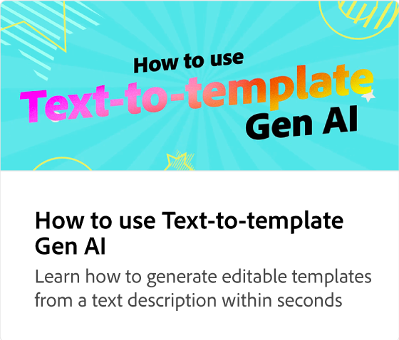

# Uw tekstontwerp verbeteren met Gen AI

Leer hoe je indrukwekkende ontwerpen maakt met behulp van teksteffecten die worden aangestuurd door Adobe Firefly. Met een tekstprompt kunt u buitengewone teksteffecten genereren die u kunt verfijnen en verfraaien.

>[!VIDEO](https://video.tv.adobe.com/v/3438820?quality=12&learn=on&hidetitle=true&captions=dut)

## Aanvullende video&#39;s in deze reeks

<table style="table-layout:fixed">
<tr>
   <td>
         
   </td>
   <td>
         
   </td>
   <td>
         
   </td>
   <td>
         
   </td>      
</tr>
<tr>
   <td>
      
   </td>
   <td>
      
   </td>
   <td>
      
   </td>
   <td>
      
   </td>
</tr>
</table>
