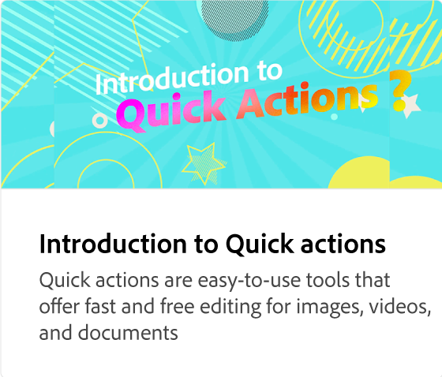

# Inleiding tot sjablonen

Ontdek duizenden professioneel ontworpen sjablonen voor al je social media- en marketingbehoeften. Sjablonen bieden een snelle manier om aangepaste inhoud te maken door opnieuw te mixen met uw eigen woorden en foto&#39;s.

>[!VIDEO](https://video.tv.adobe.com/v/3426927?quality=12&learn=on&hidetitle=true)

## Aanvullende video&#39;s in deze reeks

<table style="table-layout:fixed">
<tr>
 <td>
      
 </td>
 <td>
      
 </td>
 <td>
      
      

       
   </td>
    <td>
      
      

       
   </td>
</tr>
</table>
