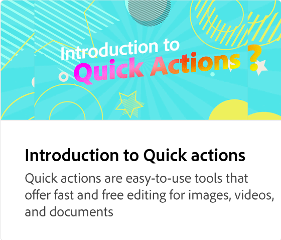

# Adobe [!DNL Express] zelfstudies

Ga aan de slag met verbluffend werk dat opvalt met generatieve AI aangedreven door Adobe Firefly. Ontwerp flyers, TikToks, hervat en Reels met Adobe Express.

## Aan de slag

<table style="table-layout:fixed">
<tr>
 <td>
      
 </td>
 <td>
      
 </td>
 <td>
      
 </td>
 <td>
      
      

       
   </td>
</tr>
</table>

## Basistaken

<table style="table-layout:fixed">
<tr>
 <td>
      
  </td>
   <td>
      
  </td>
   <td>
      
  </td>
  <td>
      
  </td>
</tr>
<tr>
   <td>
      
  </td>
   <td>
      
  </td>
   <td>
      
  </td>
   <td>
         
   </td>
</tr>
<tr>
   <td>
         
   </td>
   <td>
   
   </td>
   <td>
   
   </td>
   <td>
   
   </td>
</tr>
<tr>
   <td>
      
   </td>
   <td>
      
  </td>
  <td>
      
      

       
   </td>
   <td>
      
      

       
   </td>
</tr>
</table>

## Animatie

<table style="table-layout:fixed">
<tr>
   <td>
         
   </td>
  <td>
         
   </td>
   <td>
         
   </td>
   <td>
         
   </td>
</tr>
<tr>
   <td>
         
   </td>
   <td>
         
   </td>
   <td>
         
   </td>
   <td>
         
   </td>
</tr>
<tr>
   <td>
         
   </td>
   <td>
      
      

       
   </td>
    <td>
      
      

       
   </td>
    <td>
      
      

       
   </td>
</tr>
</table>

## Geavanceerde taken

<table style="table-layout:fixed">
<tr>
   <td>
         
   </td>
   <td>
         
   </td>
   <td>
         
   </td>
   <td>
         
   </td>      
</tr>
<tr>
   <td>
      
   </td>
   <td>
      
   </td>
   <td>
      
   </td>
   <td>
      
   </td>
</tr>
<tr>
   <td>
      
   </td>
   <td>
         
   </td>
   <td>
      
  </td>
  <td>
      
  </td>
</tr>
<tr>
   <td>
      
  </td>
  <td>
         
   </td>
   <td>
         
   </td>
   <td>
    
    

     
   </td>
</tr>
</table>

## Video

<table style="table-layout:fixed">
<tr>
   <td>
         
   </td>
  <td>
         
   </td>
   <td>
         
   </td>
   <td>
         
   </td>
</tr>
<tr>
  <td>
         
   </td>
    <td>
         
   </td>
   <td>
    
    

     
   </td>
   <td>
    
    

     
   </td>
</tr>
</table>

## Sjablonen

<table style="table-layout:fixed">
<tr>
   <td>
        
        

            <a href="lock-layers.md"><strong> hoe te en waarom slotlagen </strong></a>
            

            <em> leer waarom het belangrijk is om diverse elementen van uw malplaatje te sluiten </em>
             
    </td>
    <td>
         
         

         <a href="create-templates.md"><strong> maximaliseer efficiency: creeer herbruikbare malplaatjes </strong></a>
         

         <em> Leer hoe brengen merkconsistentie, efficiency, en kostenbesparingen aan uw organisatie met malplaatjes </em>
          
   </td>
   <td>
         
         

         <a href="share-templates.md"><strong> sparen &amp; deel malplaatjes </strong></a>
         

         <em> Leer om malplaatjes aan een merkuitrusting of een bibliotheek voor uw team te bewaren en te delen </em>
          
   </td>
   <td>
         
         

         <a href="use-templates.md"><strong> Moeiteloze merkconsistentie met malplaatjes </strong></a>
         

         <em> Leer hoe te om on-brand inhoud snel en efficiënt over uw volledige organisatie te creëren </em>
          
   </td>
</tr>
</table>