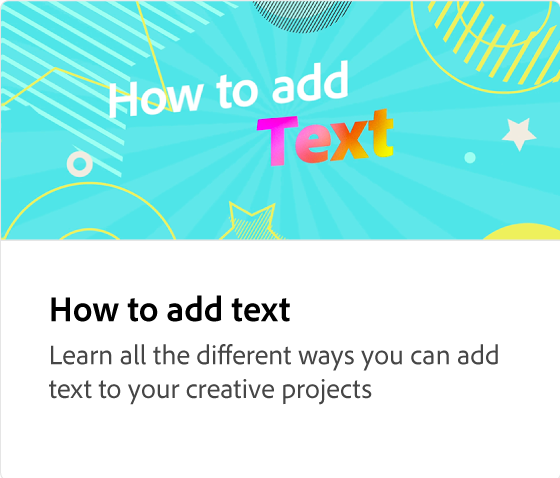

# Adobe [!DNL Express] hoe kan ik-zelfstudies

Ga aan de slag met verbluffend werk dat opvalt met generatieve AI aangedreven door Adobe Firefly. Ontwerp flyers, TikToks, hervat en Reels met Adobe Express.

<table style="table-layout:fixed">
<tr>
 <td>
      
 </td>
 <td>
      
 </td>
 <td>
      
 </td>
 <td>
      
  </td>
</tr>
<tr>
  <td>
   
  </td>
  <td>
      
  </td>
  <td>
   
  </td>
 <td>
         
 </td>
</tr>
<tr>
  <td>
         
   </td>
  <td>
         
   </td>
  <td>
      
  </td>
  <td>
      
   </td>
</tr>
<tr>
  <td>
      
  </td>
   <td>
      
  </td>
   <td>
      
  </td>
  <td>
      
  </td>
  </tr>
<tr>
  <td>
      
  </td>
  <td>
      
  </td>
  <td>
         
   </td>
  <td>
      
      

       
   </td>
</tr>
</table>
