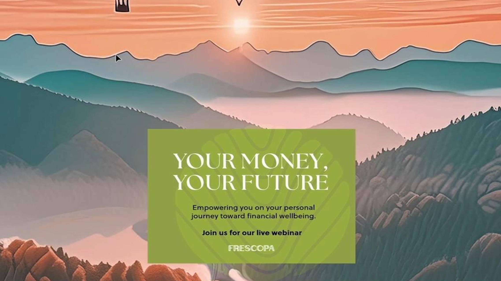
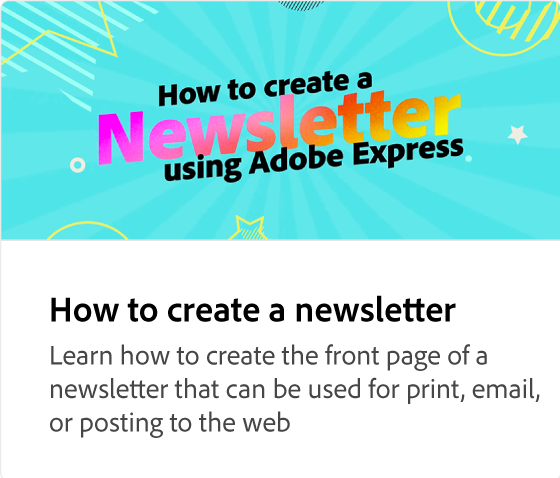
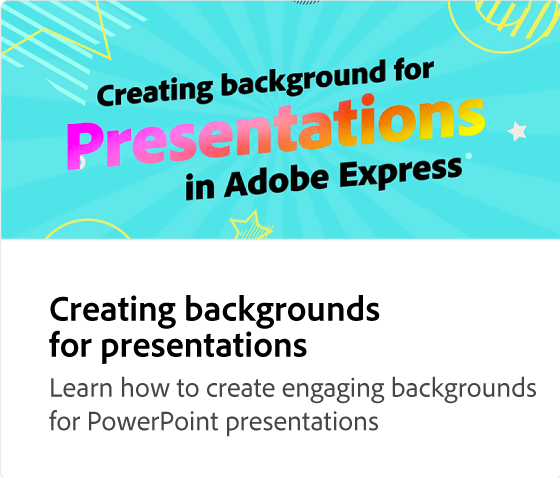
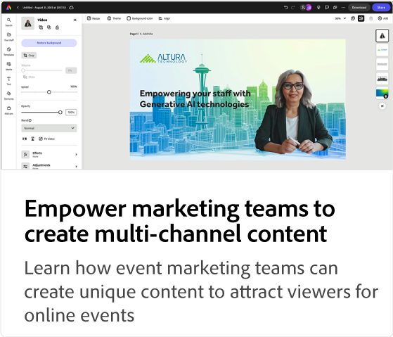

# Zelfstudies over het gebruik van hoofdletters en kleine letters voor Adobe [!DNL Express]

Ontdek hoe verschillende teams binnen je organisatie kunnen profiteren van Adobe Express.

## Nieuwe functies

>[!BEGINTABS]

>[!TAB  creeer multi-channel inhoud van HR voor gebeurtenissen ]

Leer hoe te snel [ multi-channel inhoud van u voor gebeurtenissen ](create-hr-content.md) creëren.

>[!TAB  Creërend een promotie visueel voor een online het leren cursus ]

Leer hoe te om een boeiende visuele voor een [ online het leren cursus ](promo-visual.md) tot stand te brengen.

>[!TAB  Creërend een eind-van-jaarvideo ]

Leer hoe te om een inspirerende [ eind-van-jaar video ](end-of-year-video.md) tot stand te brengen.

>[!ENDTABS]

<table style="table-layout:fixed">
<tr>
   <td>
      
      

      <a href="create-hr-content.md"> creeer multi-channel inhoud van HR voor gebeurtenissen </a>
      

      Leer hoe u snel multi-channel HR-inhoud voor gebeurtenissen kunt maken
       
   </td>
   <td>
      
      

      <a href="promo-visual.md"> Creërend een promotie visueel voor een online het leren cursus </a>
      

      Leer hoe u boeiende visuals kunt maken voor een online leercursus
       
   </td>
   <td>
      
      

      <a href="end-of-year-video.md"> Creërend een eind-van-jaarvideo </a>
      

      Leer hoe je een inspirerende end-of-year video creëert
       
   </td>
   <td>
      
      

      <a href="newsletter.md"> hoe te om een bulletin </a> te creëren
      

      Leer hoe je een dynamische voorpagina voor een nieuwsbrief maakt
       
   </td>
</tr>
<tr>
   <td>
      
      

      <a href="create-digital-screens.md"> creeer digitale het schermaankondigingen voor het bureau </a>
      

      Leer hoe je aansprekende digitale-schermaankondigingen voor het kantoor maakt
       
   </td>
    <td>
      
      

      <a href="create-backgrounds.md"> Creërend achtergronden voor presentaties </a>
      

      Leer hoe u boeiende achtergronden kunt maken voor PowerPoint-presentaties
       
   </td>
   <td>
      
      

      <a href="update-image.md"> update financiering round-up beeld </a>
      

      Leer hoe u een statische afbeelding snel kunt bijwerken
       
   </td>
   <td>
      
      

      <a href="compelling-merchandise.md"> creeer dwingende merchandising inhoud </a>
      

      Leer hoe je boeiende afbeeldingen maakt voor een nieuwe voorraad
       
   </td>
</tr>
<tr>
   <td>
      
      

      <a href="multi-channel-marketing-content.md"> laat marketingteams toe om multi-channel content te maken </a>
      

      Leer hoe u unieke inhoud maakt om kijkers voor online gebeurtenissen aan te trekken
       
   </td>
   <td>
      
      

      <a href="localized-marketing-content.md"> laat verdeelde teams toe om inhoud </a> te lokaliseren
      

      Leer hoe je content lokaliseert voor regionale marketingcampagnes
       
   </td>
   <td>
      
      

      <a href="jumpstart-ideation.md"> Jumpstart creatieve ideatie </a>
      

      Leer hoe je een vliegende start kunt maken met het ontwikkelen van creatieve content
       
   </td>
   <td>
      
      

      <a href="create-local-marketing.md"> creeer flyer inhoud voor marketing campagne met Firefly </a>
      

      Leer hoe je content lokaliseert voor een wereldwijde marketingcampagne
       
   </td>
</tr>
<tr>
   <td>
      
      

      <a href="create-on-boarding.md"> creeer het rekruteren en onboardinginhoud met Firefly </a>
      

      Leer hoe je unieke illustraties maakt voor werving en onboarding van medewerkers
       
   </td>
   <td>
      
      

      <a href="create-social-posters.md"> creeer sociale posters met Firefly </a>
      

      Leer hoe je eenvoudig een promotiecampagne voor social media kunt maken
       
   </td>
   <td>
      
      

      <a href="create-blog-graphics.md"> creeer grafische inhoud voor blogs met Firefly </a>
      

      Leer hoe je unieke grafische content maakt voor web-, blog- en social-mediacampagnes
       
   </td>
   <td>
      
      

      <a href="create-webinar-poster.md"> creeer webinar posters met Firefly </a>
      

      Leer hoe u een boeiende webinar-poster kunt maken voor een virtual reality-gebeurtenis
       
   </td>
</tr>
</table>
