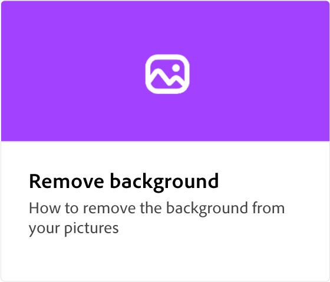
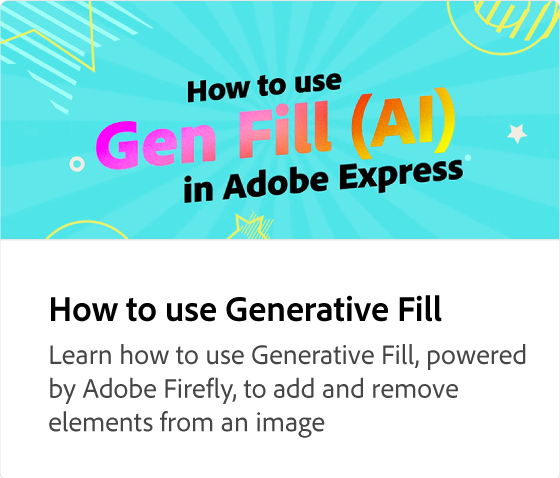

# Lettertype AI voor tekst naar sjabloon

Leer hoe u binnen enkele seconden bewerkbare sjablonen voor posts op social media, posters, flyers en kaarten kunt genereren op basis van een tekstbeschrijving. U kunt het ontwerp bewerken, lettertypen wijzigen en het project verder markeren voordat u het downloadt of deelt.

>[!VIDEO](https://video.tv.adobe.com/v/3438127?quality=12&learn=on&hidetitle=true&captions=dut)

## Aanvullende video&#39;s in deze reeks

<table style="table-layout:fixed">
<tr>
   <td>
         
   </td>
   <td>
         
   </td>
   <td>
         
   </td>
   <td>
         
   </td>      
</tr>
<tr>
   <td>
      
   </td>
   <td>
      
   </td>
   <td>
      
   </td>
   <td>
      
   </td>
</tr>
</table>
