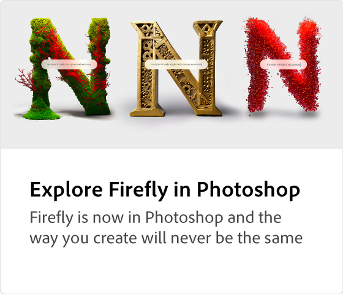

# Adobe [!DNL Firefly] overzicht

Ten vijfde, de nieuwe productreeks creatieve generatieve AI-modellen die naar Adobe-producten komen, waarbij de focus in eerste instantie ligt op het genereren van afbeeldingen en teksteffecten. Firefly biedt nieuwe manieren om creatieve workflows te identificeren, te creëren en te communiceren, terwijl het tegelijkertijd aanzienlijk verbetert.

  

## Kijk wat je kunt doen met Adobe Firefly

  

>[!VIDEO](https://video.tv.adobe.com/v/3416970t1?quality=12&learn=on&hidetitle=true)

## Meer informatie over Adobe Firefly

<table>
<tr>
   <td>
      
      

      <a href="https://firefly.adobe.com/" target="_blank"><strong>Adobe Firefly (bèta)</strong></a>
      

      <em>Word lid van het Adobe Firefly Beta-programma.</em>
       
  </td>
  <td>
      
      

      <a href="https://www.adobe.com/sensei/generative-ai/firefly.html" target="_blank"><strong>Firefly ontdekken in Photoshop</strong></a>
      

      <em>Firefly is nu in Photoshop en de manier waarop je creëert zal nooit hetzelfde zijn</em>
       
  </td>
  <td>
      
      

      <a href="webinar-experimenting.md"><strong>Experimenteren met webinar over Fireflys</strong></a>
      

      <em>Join Howard Pinsky duikt in de bèta van de Firefly in dit webinar</em>
       
  </td>
  <td>
      
      

      <a href="generative-fill.md"><strong>Generatieve vulling in Photoshop</strong></a>
      

      <em>Leer hoe je Generative Fill gebruikt op basis van Adobe Firefly</em>
       
  </td>
</tr>
</table>
