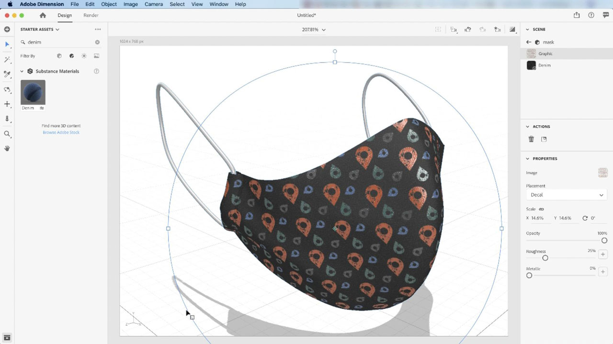

# [!DNL Dimension]

Creëer sneller boeiende content in 3D met hoogwaardige modellen, materialen en belichting. Met [!DNL Dimension] kunt u eenvoudig merkvisualisaties, illustraties, productmodellen, verpakkingsontwerpen en ander creatief werk maken.

## Door Tutorials van producten bladeren

<table style="table-layout:fixed">
<tr>
 <td>
   
    

   <a href="dimension.md#tutorial1"><strong> pas de Materialen van de Substance op 3D Modellen </strong></a> toe
    

    <em> de materialen van de Substance steunen duizenden variaties van patroon en ontwerp in één enkel materiaal </em>
     
  </td>
  <td>
    
    

     
  </td>
  <td>
    
    

     
  </td>
</tr>
</table>

## Substance materialen toepassen op 3D-modellen (11:42) {#tutorial1}

>[!VIDEO](https://video.tv.adobe.com/v/326944?hidetitle=true)

**Beschrijving**
Substance materialen ondersteunen duizenden patronen en ontwerpen in één materiaal.

In deze zelfstudie leert u hoe u:
* Creëer sneller boeiende content in 3D met hoogwaardige modellen, materialen en belichting

**door wordt voorgesteld:**
Jim Babbage, Senior Solutions Consultant (Digital Media)

**Middelen van het Dimension**

[&#x200B; Leren &amp; Steun &#x200B;](https://helpx.adobe.com/nl/support/dimension.html) is uw hub voor extra leerprogramma&#39;s, [&#x200B; wat &#x200B;](https://helpx.adobe.com/nl/dimension/user-guide.html/dimension/using/whats-new.ug.html), en verbindingen aan communautaire forums nieuw is.

**Versie van oktober 2020**

Gebruik deze functies (en meer!) door de nieuwste update te downloaden vanaf uw Creative Cloud Desktop App.
