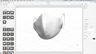

# Ontwerpen voor plug-in afdrukken - Een gezichtsmasker aanpassen

Zou het niet cool zijn als je een gezichtsmasker kon aanpassen met je eigen illustraties? Met de insteekmodule Adobe Design to Print kun je je ontwerpen visualiseren op honderden Zazle-producten en rechtstreeks publiceren naar hun online marktplaats.

## Tutorials van projecten bekijken

<table style="table-layout:fixed">
<tr>
 <td>
   
    

   <a href="handsonproject.md#tutorial1"><strong>De insteekmodule Photoshop Design to Print installeren</strong></a>
    

    <em>Gebruik de krachtige tools voor selectie en kleurbewerking in Adobe Photoshop om een afbeelding drastisch te wijzigen, zodat deze aansluit bij de merkbehoeften van uw bedrijf</em>
     
  </td>
  <td>
    
    

    <a href="handsonproject.md#tutorial2"><strong>Een Gezichtsmasker met ontwerp aanpassen om af te drukken</strong></a>
    

    <em>Uw eigen Zazzle-gezichtsmasker aanpassen</em>
     
  </td>
  <td>
    
    

   <a href="handsonproject.md#tutorial3"><strong>Maak een 3D-visualisatie van uw gezichtsmasker</strong></a>
    

    <em>Een 3D-visualisatie maken van uw gezichtsmasker voor de gebeurtenisgalerie</em>
     
  </td>
</tr>
</table>

## Insteekmodule Photoshop Design to Print installeren (1:50) {#tutorial1}

>[!VIDEO](https://video.tv.adobe.com/v/327096?hidetitle=true)

**Beschrijving**
Leer hoe u de plug-in Design to Print voor Photoshop installeert.

In deze zelfstudie leert u hoe u:
* Visualiseer je ontwerpen op producten zoals kleding, accessoires, briefpapier en ingebouwde muur!
* Publiceren naar de online marktplaats van Dazzle

**Voorgesteld door:**
Patti Sokol, Principal Solutions Consultant (Digital Media)

## Een vlakmasker aanpassen met ontwerp voor afdrukken (7:54) {#tutorial2}

>[!VIDEO](https://video.tv.adobe.com/v/327097?hidetitle=true)

**Beschrijving**
Uw eigen Zazzle-gezichtsmasker aanpassen

In deze zelfstudie leert u hoe u:
* Visualiseer je ontwerpen op producten zoals kleding, accessoires, briefpapier en ingebouwde muur!
* Publiceren naar de online marktplaats van Dazzle

**Klik op Afbeelding om Leerontwerp te downloaden om PDF af te drukken**

**Voorgesteld door:**
Patti Sokol, Principal Solutions Consultant (Digital Media)

## Een 3D-visualisatie van uw gezichtsmasker maken (7:54) {#tutorial3}

>[!VIDEO](https://video.tv.adobe.com/v/327098?hidetitle=true)

**Beschrijving**
Een 3D-visualisatie maken van uw gezichtsmasker voor de gebeurtenisgalerie

In deze zelfstudie leert u hoe u:
* Maak eenvoudig fotorealistische 3D-visualisaties
* Voeg materialen en besturingsverlichting toe voor een professioneel uitzicht
* Importeer assets om je merk of andere ontwerpen toe te passen

**Klik op Afbeelding om te downloaden [!DNL Dimension] Bestand met 3D-model van witmasker**

**Voorgesteld door:**
Patti Sokol, Principal Solutions Consultant (Digital Media)
