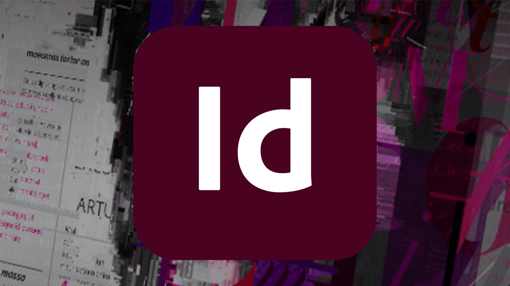

# InDesign Server

Adobe InDesign® Server-software biedt een krachtige en schaalbare engine die gebruikmaakt van het ontwerp, de lay-out en de typografische mogelijkheden van InDesign, zodat u programmatisch aantrekkelijke, geautomatiseerde documenten kunt maken.

## Door Tutorials van producten bladeren

<table style="table-layout:fixed">
<tr>
 <td>
   
    

   <a href="indesignserver.md#tutorial1"><strong>Gegevensgestuurde inhoud van InDesigns Server</strong></a>
    

    <em>Datagestuurd ontwerp kan via programmacode worden bereikt met InDesign Server</em>
     
  </td>
  <td>
    
    

     
  </td>
  <td>
    
    

     
  </td>
</tr>
</table>

## Gegevensgestuurde inhoud InDesign Server (4:14) {#tutorial1}

>[!VIDEO](https://video.tv.adobe.com/v/326901?hidetitle=true)

**Beschrijving**
Datagestuurd ontwerp kan via programmacode worden bereikt met InDesign Server.

In deze zelfstudie leert u hoe u:
* InDesign-sjablonen maken met vooraf opgemaakte tekst- of objectstijlen
* Stroom in externe datagestuurde content voor een snellere personalisatie van content
* Steunfunctie-PDF genereren of vastzetten in andere AEM uitvoerindelingen van uw lay-out

**Voorgesteld door:**
Eric Rowse, Senior Solutions Consultant (Digital Media)

## Aanvullende bronnen voor InDesign Server

<table>
<tr>
 <td>
   
    

   <a href="https://www.adobe.com/products/indesignserver/buying-guide.html"><strong>InDesign Server: Koopgids</strong></a>
    

    <em>Informatiebronnen beschikbaar voor interne ontwikkelaars of partners</em>
     
  </td>
  <td>
   
    

   <a href="https://www.adobe.com/products/indesignserver/partner.html"><strong>InDesign Server: Een partner zoeken</strong></a>
    

    <em>Terwijl u de expertise hebt om zich intern te ontwikkelen, raadt de Adobe u aan samen met partners te werken om de oplossing te vinden die aan uw vereisten voldoet</em>
     
  </td>
  <td>
    
    

     
  </td>
</tr>
</table>

**Bronnen voor InDesigns Server**

[Meer informatie en ondersteuning](https://www.adobe.com/products/indesignserver.html) Dit is uw hub voor extra zelfstudies, nieuwe functies en koppelingen naar communityforums.

**Versie van oktober 2020**

Gebruik deze functies (en meer!) door de nieuwste update te downloaden vanaf uw Creative Cloud Desktop App.
