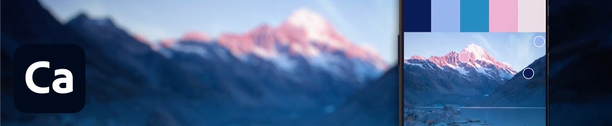

# Zelfstudies

Als creatief bedrijf moet je samenwerken met gedistribueerde teams, schaalbare processen instellen en voldoen aan bedrijfssystemen en richtlijnen. Deze zelfstudies helpen u nieuwe functies te leren in de 2021-versie van het Creative Cloud, vanuit een ondernemingsperspectief.

## Tutorials per desktopproduct

<table style="table-layout:fixed">
<tr>
 <td>
    
    

    <a href="acrobat-sign.md"><strong>Acrobat en Adobe Sign</strong></a>
    

    <em>PDF-documenten en -formulieren maken, bewerken en ondertekenen</em>
     
  </td>
  <td>
    
    

    <a href="dimension.md"><strong>Dimension</strong></a>
    

    <em>Maak fotorealistische 3D-afbeeldingen voor branding, productafbeeldingen en verpakkingsontwerp</em>
     
  </td>
  <td>
    
    

    <a href="illustrator.md"><strong>Illustrator</strong></a>
    

    <em>Vectorafbeeldingen en -illustraties</em>
     
  </td>
</tr>
<tr>
 <td>
    
    

    <a href="indesign.md"><strong>InDesign</strong></a>
    

    <em>Paginaontwerp en -lay-out voor gedrukte en digitale publicaties</em>
     
  </td>
  <td>
    
    

    <a href="photoshop.md"><strong>Photoshop</strong></a>
    

    <em>Bewerk, construeer en creëer prachtige afbeeldingen, graphics en kunstwerken op je desktop</em>
     
  </td>
  <td>
    
    

    <a href="rush.md"><strong>Rush</strong></a>
    

    <em>Creëer en deel overal online video’s</em>
     
  </td>
</tr>
<tr>
 <td>
    
    

    <a href="xd.md"><strong>XD</strong></a>
    

    <em>Gebruikerservaringen ontwerpen, prototypen maken en delen</em>
     
  </td>
  <td>
    
    

     
  </td>
  <td>
    
    

     
  </td>
</tr>
</table>

### Tutorials via mobiele app

<table style="table-layout:fixed">
<tr>
 <td>
    
    

    <a href="capture.md"><strong>Capture</strong></a>
    

    <em>Zet elke afbeelding om in een kleurthema, vectorafbeelding, penseel en meer</em>
     
  </td>
  <td>
    
    

    <a href="fresco.md"><strong>Fresco</strong></a>
    

    <em>Herontdek het plezier om overal te tekenen en schilderen</em>
     
  </td>
  <td>
    
    

    <a href="illustratoripad.md"><strong>Illustrator op iPad</strong></a>
    

    <em>Vectorafbeeldingen en -illustraties</em>
     
  </td>
</tr>
<tr>
 <td>
    
    

    <a href="photoshopipad.md"><strong>Photoshop op iPad</strong></a>
    

    <em>Prachtige afbeeldingen, illustraties en kunstwerken maken, bewerken en combineren op desktop en iPad</em>
     
  </td>
  <td>
    
    

     
  </td>
  <td>
    
    

     
  </td>
</tr>
</table>

### Tutorials per integratie

<table style="table-layout:fixed">
<tr>
 <td>
    
    

    <a href="aem.md"><strong>AEM Assets &amp; Asset Link</strong></a>
    

    <em>Digitaal assetmanagement van de volgende generatie</em>
     
  </td>
  <td>
    
    

    <a href="creativeclouddesktopapp.md"><strong>Creative Cloud desktop-app</strong></a>
    

    <em>De desktop-app van het Creative Cloud is je centrum voor het beheren van CC-apps, -services en -samenwerking, en meer!</em>
     
  </td>
  <td>
    
    

    <a href="cclibraries.md"><strong>CC Libraries</strong></a>
    

    <em>Houd je assets en je projecten merkgericht</em>
     
  </td>
</tr>
<tr>
<td>
    
    

    <a href="indesignserver.md"><strong>InDesign Server</strong></a>
    

    <em>De geavanceerde tools van InDesign in combinatie met aangepaste automatisering</em>
     
  </td>
 <td>
    
    

    <a href="stock.md"><strong>Adobe [!DNL Stock]</strong></a>
    

    <em>Hoogwaardige digitale afbeeldingen, illustraties, video's, audio, sjablonen en meer</em>
     
  </td>
  <td>
    
    

     
  </td>
</tr>
</table>

### Hands-on project: Maak uw eigen gezichtsmasker

<table style="table-layout:fixed">
<tr>
 <td>
    
    

    <a href="handsonproject.md"><strong>Uw eigen gezichtsmasker maken</strong></a>
    

    <em>Met de insteekmodule Adobe Design to Print kun je je ontwerpen visualiseren op honderden Zazzle-producten en rechtstreeks publiceren naar hun online marktplaats</em>
     
  </td>
  <td>
    
    

     
  </td>
  <td>
    
    

     
  </td>
</tr>
</table>
