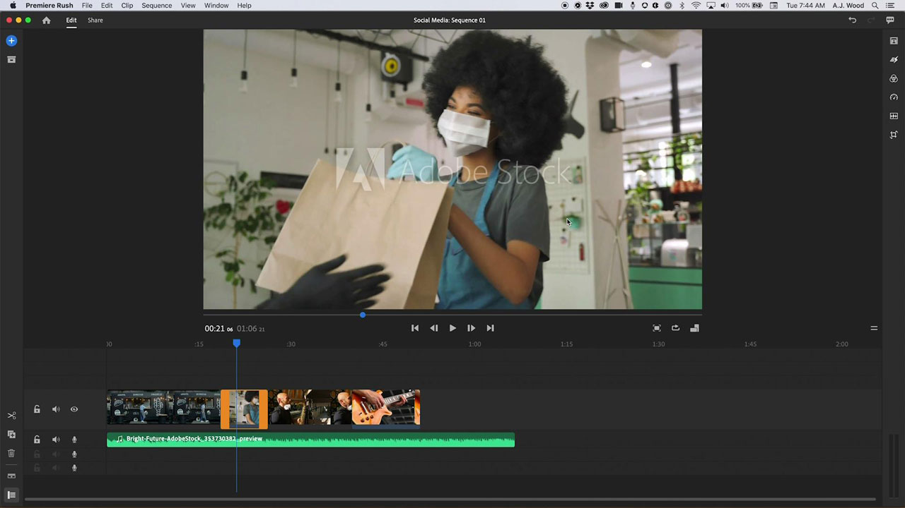

# [!DNL Rush]

Premiere [!DNL Rush] is de eerste alles-in-één-app voor videobewerking op verschillende apparaten waarmee je eenvoudiger dan ooit online content kunt creëren en delen. Met deze geïntegreerde desktop- en mobiele oplossing worden je projecten en bewerkingen automatisch gesynchroniseerd naar de cloud, zodat je overal en op elk apparaat kunt werken.

## Door Tutorials van producten bladeren

<table style="table-layout:fixed">
<tr>
 <td>
   
    

   <a href="rush.md#tutorial1"><strong> creeer een Video van Sociale Media </strong></a>
    

    <em> Adobe [!DNL Rush] laat u aan om het even welk apparaat werken en maakt professionele output gemakkelijk genoeg voor beginners </em>
     
  </td>
  <td>
    
    

     
  </td>
  <td>
    
    

     
  </td>
</tr>
</table>

## Een video over sociale media maken (18:11) {#tutorial1}

>[!VIDEO](https://video.tv.adobe.com/v/326900?hidetitle=true)

**Beschrijving**
Vertel uw verhaal met video en audio van Adobe [!DNL Stock] . Met Adobe [!DNL Rush] kunt u op elk apparaat werken en professionele uitvoer eenvoudig genoeg maken voor beginners.

In deze zelfstudie leert u hoe u:
* Video naadloos bewerken op desktop, tablet en telefoon
* Houd je onderwerp gecentreerd rond horizontale, vierkante en verticale formulierfactoren met de AI-technologiefunctie voor automatisch vernieuwen
* Met MoGRTS (Motion Graphic Templates) kunt u professioneel ogende, gemakkelijk aanpasbare titels en lager-derde
* Eenvoudig exporteren en rechtstreeks publiceren naar social-mediakanalen
* [!DNL Rush] projecten openen in Adobe Premiere Pro

**door wordt voorgesteld:**
A.J. Wood, Solutions Consultant (Digital Media)

**[!DNL Rush]Bronnen**

[ Leren &amp; Steun ](https://helpx.adobe.com/support/premiere-rush.html) is uw hub voor extra leerprogramma&#39;s, [ wat ](https://helpx.adobe.com/premiere-rush/user-guide.html/premiere-rush/help/whats-new.ug.html), en verbindingen aan communautaire forums nieuw is.

**Versie van oktober 2020**

Gebruik deze functies (en meer!) door de nieuwste update te downloaden vanaf uw Creative Cloud Desktop App.
