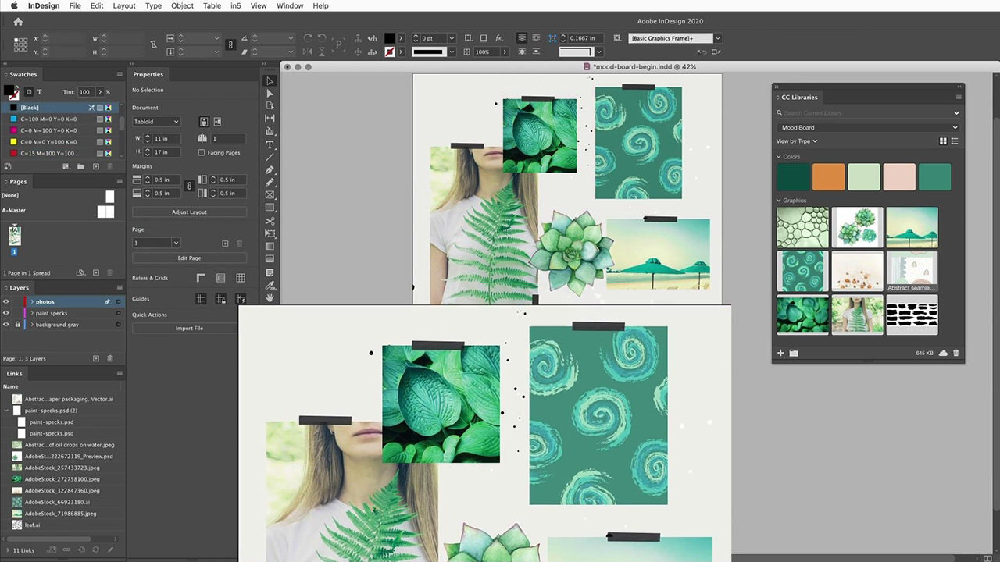

# Adobe [!DNL Stock] zelfstudies

Creatieve medewerkers staan onder druk om snel nieuwe, visueel aantrekkelijke content te leveren die de aandacht trekt en vasthoudt. Adobe [!DNL Stock] voor ondernemingen biedt creatieve teams toegang tot meer dan 200 miljoen afbeeldingen, video&#39;s, sjablonen, illustraties, audiobestanden en 3D-assets - allemaal vanuit de creatieve Adobe-apps die ze dagelijks gebruiken.

## Klik om een Adobe weer te geven [!DNL Stock] zelfstudie

<table>
<tr>
   <td>
      
      

      <a href="searchstock.md"><strong>Adobe zoeken [!DNL Stock] licentiegeschiedenis</strong></a>
      

      <em>Leer hoe je snel de Adobe van je organisatie kunt doorzoeken [!DNL Stock] licentiegeschiedenis in Creative Cloud voor ondernemingen</em>
       
  </td>
  <td>
      
      

      <a href="handdrawn.md"><strong>Voeg een handgetekende esthetiek toe aan Adobe [!DNL Stock] afbeeldingen</strong></a>
      

      <em>Breid je creatieve marketing uit met unieke technieken die diepte en dimensie toevoegen aan je afbeeldingen met Photoshop for iPad</em>
       
  </td>
  <td>
   
    

   <a href="flairtypography.md"><strong>Flitser toevoegen aan typografie met maskers en animatie</strong></a>
    

    <em>Breng je tekst tot leven met elementen van Adobe [!DNL Stock] en animatiestijlen uit After Effects</em>
     
  </td>
</tr>
<tr>
   <td>
      
      

      <a href="animatevector.md"><strong>Een Adobe animeren [!DNL Stock] vectorillustratie in Photoshop</strong></a>
      

      <em>Animatie in je nieuwsbrief opnemen met bewerkbare vectoren voor Adobe [!DNL Stock]</em>
       
  </td>
   <td>
      
      

      <a href="annualreport.md"><strong>Beginnen met uw jaarverslag met een video die is gemaakt met Adobe [!DNL Stock] en Spark Video</strong></a>
      

      <em>Maak van je jaarverslag een verhaal met Adobe [!DNL Stock] en Spark Video</em>
       
  </td>
  <td>
      
      

      <a href="customanimations.md"><strong>Creatief tot leven brengen met aangepaste animaties van Adobe [!DNL Stock]</strong></a>
      

      <em>Adobe gebruiken [!DNL Stock] afbeeldingen, structuren, patronen naar aangepaste animaties in Photoshop</em>
       
  </td>
</tr>
<tr>
   <td>
      
      

      <a href="changecolors.md"><strong>Een Adobe wijzigen [!DNL Stock] de kleuren van de afbeelding om overeen te komen met uw verhaal</strong></a>
      

      <em>Een unieke foto zoeken in Adobe [!DNL Stock] en pas vervolgens de kleur in Adobe Photoshop aan uw wensen aan</em>
       
  </td>
  <td>
      
      

      <a href="collage.md"><strong>Een 3D-collage maken voor een poster met Adobe [!DNL Stock] afbeeldingen</strong></a>
      

      <em>Een collage ontwerpen in Adobe Illustrator met een opvallend 3D-effect van afbeeldingen in Adobe [!DNL Stock]</em>
       
  </td>
  <td>
      
      

      <a href="boldlabel.md"><strong>Een vet label met Adobe maken [!DNL Stock] sjablonen en slimme Photoshop-objecten</strong></a>
      

      <em>Ontwerp en visualiseer je eigen ontwerpen met realistische verpakkingssjablonen van Adobe [!DNL Stock]</em>
       
  </td>
</tr>
<tr>
   <td>
      
      

      <a href="infographic.md"><strong>Maak bedrijfsrichtlijnen voor infographic met Adobe [!DNL Stock]</strong></a>
      

      <em>Verschillende middelen van Adobe combineren [!DNL Stock] om richtlijnen te communiceren in de vorm van visueel aantrekkelijke infographics</em>
       
  </td>
 <td>
      
      

      <a href="featurecomparison.md"><strong>Een vergelijkingsoverzicht voor productfuncties maken met Adobe [!DNL Stock]</strong></a>
      

      <em>Maak een afbeelding waarin productprijzingsplannen worden vergeleken om toekomstige klanten in één oogopslag de informatie te geven die ze nodig hebben</em>
       
  </td>
  <td>
      
      

      <a href="surrealcomposite.md"><strong>Een semi-surrealistische samenstelling maken met Adobe [!DNL Stock]</strong></a>
      

      <em>Maak een gedenkwaardige redactionele afbeelding door meerdere afbeeldingen te combineren met kleur-, beweging- en maskeereffecten</em>
       
  </td>
</tr>
<tr>
   <td>
      
      

      <a href="surrealpattern.md"><strong>Een semi-surrealistisch patroon met Adobe maken [!DNL Stock]</strong></a>
      

      <em>Creëer een prachtig, naadloos patroon op basis van surrealistische beelden van Adobe [!DNL Stock]</em>
       
  </td>
   <td>
      
      

      <a href="productconfigurator.md"><strong>Een interactieve productconfigurator maken met Adobe [!DNL Stock]</strong></a>
      

      <em>Profiteer van de kracht van interactiviteit, animatie en bewerkbare illustraties van Adobe [!DNL Stock] financiële informatie visueel presenteren</em>
       
  </td>
  <td>
      
      

      <a href="interactivetourismphoto.md"><strong>Een interactieve toeristische foto maken met Adobe [!DNL Stock] en XD</strong></a>
      

      <em>Snel een interactieve foto maken in uw websiteprototype met Adobe [!DNL Stock] en XD</em>
       
  </td>
</tr>
<tr>
   <td>
      
      

      <a href="animationemail.md"><strong>Animaties maken voor e-mail met Adobe [!DNL Stock] en Photoshop</strong></a>
      

      <em>Geef je e-mails een nieuwe impuls met Animatie via stoppen met werken met Adobe [!DNL Stock] en Photoshop</em>
       
  </td>
 <td>
      
      

      <a href="brandgradients.md"><strong>Creëer coherente merkafbeeldingen met prachtige verlopen en Adobe [!DNL Stock] assets</strong></a>
      

      <em>Creëer merkeenheid met verschillende afbeeldingen door kleuren en verlopen te combineren in je reclamecampagne</em>
       
   </td>
  <td>
      
      

      <a href="webgraphics.md"><strong>Maak aansprekende webafbeeldingen door Adobe te combineren [!DNL Stock] afbeeldingen met CSS</strong></a>
      

      <em>Creëer merkeenheid met verschillende afbeeldingen door kleuren en verlopen te combineren in je reclamecampagne</em>
       
  </td>
</tr>
<tr>
   <td>
      
      

      <a href="moodboard.md"><strong>Creëer in een mum van tijd inspirerende stemmingsborden met Adobe [!DNL Stock]</strong></a>
      

      <em>Maak een whiteboard voor het project om informatie, ideeën, visuals en kleurenpaletten aan teams/klanten door te geven</em>
       
  </td>
  <td>
      
      

      <a href="realisticcomposite.md"><strong>Maak realistische fotocomposities met Adobe [!DNL Stock] afbeeldingen</strong></a>
      

      <em>Twee grote Adobe samenvoegen [!DNL Stock] foto's om mensen in je posts op social media te plaatsen</em>
       
  </td>
   <td>
   
    

   <a href="loadingscreen.md"><strong>Een animatie op het laadscherm aanpassen met Adobe [!DNL Stock] en XD</strong></a>
    

    <em>Vectorillustraties van Adobe aanpassen [!DNL Stock] om een chilling laadscherm voor een mobiele app te maken</em>
     
  </td>
</tr>
<tr>
   <td>
   
    

   <a href="presentationtemplate.md"><strong>Een Adobe aanpassen [!DNL Stock] presentatiesjabloon om er professioneel uit te zien, maar toch opvallend</strong></a>
    

    <em>Creëer binnen enkele minuten een prachtige gestileerde presentatie met afbeeldingen en sjablonen van Adobe [!DNL Stock] en enkele gebruiksvriendelijke speciale effecten</em>
     
  </td>
   <td>
   
    

   <a href="customizecolors.md"><strong>De kleuren in een Adobe aanpassen [!DNL Stock] vectorillustratie</strong></a>
    

    <em>Voeg je project mooier toe met een fantastische illustratie. Vind de perfecte vector in Adobe [!DNL Stock]en past vervolgens de kleuren met Adobe Illustrator aan die in het palet van uw project</em>
     
  </td>
   <td>
      
      

      <a href="assets/AddMotiontoStillImageswithAdobeStockandPhotoshop.pdf"><strong>Beweging toevoegen aan stilstaande beelden met Adobe [!DNL Stock] en Photoshop (PDF)</strong></a>
      

      <em>Verbeeld je doelgroepen op elk scherm door video op te nemen in een stilstaand beeld</em>
       
   </td>
</tr>
<tr>
   <td>
   
    

   <a href="assets/CreateacompositewithPhotoshopontheiPadandAdobeStockimages.pdf"><strong>Een compositie maken met Photoshop op de iPad en de Adobe [!DNL Stock] afbeeldingen (PDF)</strong></a>
    

    <em>Leer hoe je een van je favoriete Adobe Creative Cloud-apps op een geheel nieuwe manier gebruikt, dankzij de kracht van Photoshop op je iPad</em>
     
  </td>
   <td>
   
    

   <a href="assets/CreateaUniqueEditorialGraphicwithAfterEffectsandAdobeStock.pdf"><strong>Een Adobe animeren [!DNL Stock] vectorillustratie in Photoshop (PDF)</strong></a>
    

    <em>Door After Effects te combineren met Adobe [!DNL Stock]kunt u snel verbluffende speciale effecten creëren waarmee u een verhaal visueel kunt vertellen</em>
     
  </td>
   <td>
      
      

      <a href="assets/CreateUniqueGraphicsbyCombiningAdobeStockImages.pdf"><strong>Maak unieke afbeeldingen door Adobe te combineren [!DNL Stock] afbeeldingen (PDF)</strong></a>
      

      <em>Breng twee verschillende afbeeldingen samen om een geheel nieuwe scène voor uw ontwerpprojecten te maken. Adobe [!DNL Stock] en Adobe Photoshop maakt het gemakkelijk</em>
       
   </td>
</tr>
<tr>
   <td>
      
      

      <a href="assets/CreatingaHalloweenCinemagraphwithPhotoshopCCandAdobeStock.pdf"><strong>Een Halloween-filmfragment maken met Photoshop CC en Adobe [!DNL Stock] (PDF)</strong></a>
      

      <em>Een filmfragment maken door video's, illustraties en foto's samen te stellen met Adobe Photoshop</em>
       
  </td>
   <td>
      
      

      <a href="assets/PutyourDatainMotionwithAdobeStockandPremierePro.pdf"><strong>Zet je data in beweging met Adobe [!DNL Stock] en Premiere Pro (PDF)</strong></a>
      

      <em>Laat je data tot leven komen om een overtuigender verhaal te vertellen met behulp van Adobe [!DNL Stock] en Adobe Premiere Pro</em>
       
  </td>
   <td>
      
      

      <a href="assets/RecolorAdobeStockVectorArtworkwithAdobeIllustratortoGetExactlytheLookYouWant.pdf"><strong>Adobe opnieuw kleuren [!DNL Stock] vectorillustraties met Adobe Illustrator om precies de gewenste look te verkrijgen (PDF)</strong></a>
      

      <em>Adobe [!DNL Stock] maakt het gemakkelijk om unieke vectorafbeeldingen te vinden, en Adobe Illustrator biedt u de mogelijkheid om deze snel aan te passen aan uw creatieve visie</em>
       
   </td>
 </tr> 
 <tr>
   <td>
      
      

      <a href="assets/ShowOffyourDesignWorkintheRealWorldwithAdobeStockandPhotoshop.pdf"><strong>Laat je ontwerpwerk zien in de echte wereld met Adobe [!DNL Stock] en Photoshop (PDF)</strong></a>
      

      <em>Ga als volgt te werk om uw werk te tonen in een realistisch uitziende Adobe [!DNL Stock] sjabloon met Adobe Photoshop</em>
       
  </td>
   <td>
      
      

      <a href="assets/UncoveramazingdetailsinAdobeStockimageswithLightroomformobile.pdf"><strong>Ontdek verbluffende details in Adobe [!DNL Stock] afbeeldingen met Lightroom for mobile (PDF)</strong></a>
      

      <em>Ontdek de kracht van Lightroom op je mobiele apparaat om het beste uit je afbeeldingen te halen</em>
       
  </td>
   <td>
      
      

      <a href="assets/VisualizePosterDesignsintheRealWorldwithAdobeStockandPhotoshop.pdf"><strong>Visualiseer posterontwerpen in de echte wereld met Adobe [!DNL Stock] en Photoshop (PDF)</strong></a>
      

      <em>Toon je ontwerpen in een levensechte omgeving om een beter inzicht te krijgen in hoe ze eruit zien in de wereld</em>
       
  </td>
</tr>
</table>
