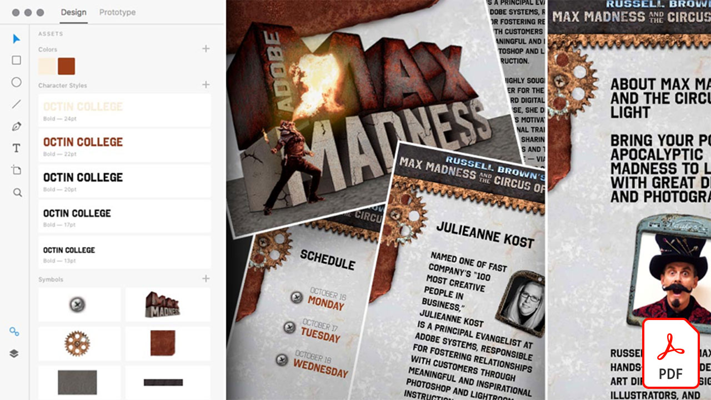

# Adobe XD-zelfstudies

Adobe XD is een tool voor het ontwerpen en prototypen van gebruikerservaringen voor het ontwerpen van websites, apps, spraakinterfaces, games en andere soorten digitale ervaringen.

## Klik om een Adobe XD-zelfstudie te bekijken

<table>
<tr>
 <td>
   
    

   <a href="components.md"><strong>Ga gerust zitten met [!UICONTROL Components] in Adobe XD</strong></a>
    

    <em>Leer hoe u [!UICONTROL Components] kunt gebruiken om u ongekende flexibiliteit te bieden voor het toepassen van zowel snelheid als consistentie op uw ontwerpworkflow</em>
     
  </td>
  <td>
   
    

   <a href="assets/ControlMultipleXDArtboardswithNestedSymbols.pdf"><strong>Meerdere XD tekengebieden besturen met geneste symbolen (PDF)</strong></a>
    

    <em>Symbolen bieden een uitstekende manier om herbruikbare illustraties en tekst te maken die meerdere keren kan worden toegepast op verschillende tekengebieden in uw project</em>
     
  </td>
  <td>
   
    

   <a href="assets/CreateaZoomableeCommercePhotowithXDandAdobeStock.pdf"><strong>Een zoombare eCommerce-foto maken met XD en Adobe [!DNL Stock] (PDF)</strong></a>
    

    <em>Door fotografie met hoge resolutie te combineren met de functie Auto-Animate van Adobe XD, kun je boeiendere ervaringen ontwerpen voor je website</em>
     
  </td>
</tr>
<tr>
 <td>
   
    

   <a href="assets/CreatingaRotatingProductInterfaceforECommercewithAdobeXD.pdf"><strong>Een roterende productinterface maken voor e-commerce met Adobe XD (PDF)</strong></a>
    

    <em>Ontwerp een interface die een draaiende weergave van je product biedt, en je kunt je ontwerp omzetten in een interactief prototype dat precies laat zien hoe de ervaring werkt op het web of mobiele apparaten</em>
     
  </td>
  <td>
   
    

   <a href="assets/DesignandPrototypeanInteractiveQuizwithXD.pdf"><strong>Een interactieve quiz ontwerpen en prototypen maken met XD (PDF)</strong></a>
    

    <em>Ontwerp feedback die een gebruiker tijdens een project zal tegenkomen</em>
     
  </td>
  <td>
   
    

   <a href="assets/DesignInteractiveProjectswithMicroAnimationsinXD.pdf"><strong>Interactieve projecten ontwerpen met microanimaties in XD (PDF)</strong></a>
    

    <em>Leer hoe u met Adobe XD interactieve animatieprototypen van uw ontwerpen maakt</em>
     
  </td>
</tr>
<tr>
 <td>
   
    

   <a href="assets/JumpstartyourXDProjectfromaPhotoshopFile.pdf"><strong>Geef je XD project een vliegende start vanuit een Photoshop-bestand (PSD) (PDF)</strong></a>
    

    <em>Adobe XD biedt enkele fantastische interactieve ontwerptools die samenwerken met je bestaande workflow, waardoor je je interactieve ontwerpvisie naar een hoger plan kunt tillen</em>
     
  </td>
  <td>
   
    

   <a href="assets/MobileWebExperienceswithXD.pdf"><strong>Een mobiele webervaring ontwerpen met XD (PDF)</strong></a>
    

    <em>Bekijk het ontwerpproces voor de Russell Brown MAX Madness mobiele webgalerie achter de schermen met Adobe XD</em>
     
  </td>
  <td>
   
    

   <a href="assets/PrototypeaMobileWebExperiencewithAdobeXD.pdf"><strong>Een prototype maken van een mobiele webervaring met Adobe XD (PDF)</strong></a>
    

    <em>Ervaringsontwerp vereist strategie, ontwerp en functionele prototypen — en Adobe XD geeft je de kracht om alles te doen</em>
     
  </td>
</tr>
<tr>
   <td>
   
    

   <a href="assets/PrototypeaMobileWebExperiencewithAdobeXD.pdf"><strong>Het herhalingsraster opladen in XD met externe tekst en afbeeldingen (PDF)</strong></a>
    

    <em>Combineer het herhalingsraster met externe tekst en afbeeldingen om uw productiviteit te verhogen</em>
     
  </td>
  <td>
   
    

   <a href="assets/BehindtheScenesofMAXMadnesswithAdobeXD.pdf"><strong>Achter de scènes van MAX Madness met Adobe XD (PDF)</strong></a>
    

    <em>Het bieden van een geoptimaliseerde mobiele webervaring kan echt resoneren met je gebruikers</em>
     
  </td>
</tr>
</table>
